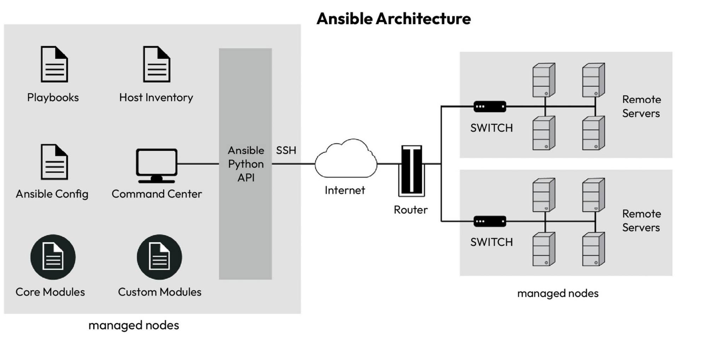
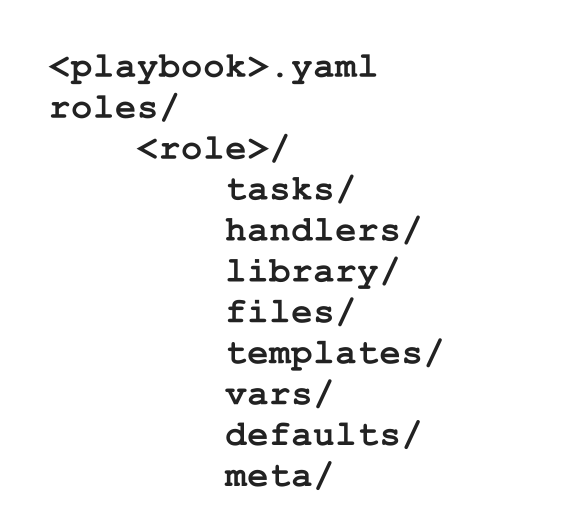

---
> Ansible is a configuration management tool that follows Configuration-as-Code (CaC) principle. It uses ssh to communicate with managed nodes, thus we do not need to install agents on these nodes. The architecture of Ansible contains control node, and managed nodes. Control node must have Ansible installed, and the managed nodes should allow SSH connection that is coming from control node. The architecture can be seen down below.
> 
> 
> 
> 

```bash
# For the control node, this script creates a user named ansible, gives sudo access, generates an ssh key pair, adds web and db vms into known hosts, then install sshpass to pass public key to them, and finally shares its public key to these vms by passing their password value for ansible user within these vms.

#!/bin/sh
sudo useradd -m ansible
echo 'ansible ALL=(ALL) NOPASSWD:ALL' | sudo tee -a /etc/sudoers
sudo su - ansible << EOF
ssh-keygen -t rsa -N '' -f ~/.ssh/id_rsa
sleep 120
ssh-keyscan -H web >> ~/.ssh/known_hosts
ssh-keyscan -H db >> ~/.ssh/known_hosts
sudo apt update -y && sudo apt install -y sshpass
echo "${admin_password}" | sshpass ssh-copy-id ansible@web
echo "${admin_password}" | sshpass ssh-copy-id ansible@db
EOF
```
---
```bash
# For the managed nodes, this script creates a user named ansible, makes it sudoers, and switches to that ansible user. After that, it creates a ssh-keypair, then changes the password to the password that is defined in .tfvars file. {admin_password} variable is passed with the following definition in terraform file:
# data "template_file" "managed_nodes_init" {
#  template = file("managed-nodes-user-data.sh")
#  vars = {
#    admin_password = var.admin_password
#   }
# }

#!/bin/sh
sudo useradd -m ansible
echo 'ansible ALL=(ALL) NOPASSWD:ALL' | sudo tee -a /etc/sudoers
sudo su - ansible << EOF
ssh-keygen -t rsa -N '' -f ~/.ssh/id_rsa
printf "${admin_password}\n${admin_password}" | sudo passwd ansible
EOF

```
---

> **Note**: An inventory file within Ansible is a file that allows you to group your managed nodes according to roles. For example, you can define roles such as webserver and dbserver and group related servers together. The default location of the Ansible inventory file is `/etc/ansible/hosts`. If you look at the `/etc/ansible` directory ownership using `ls -l /etc/ansible`, it is owned by the root user. We want to use the ansible user that we created for security purposes. Therefore, we must change the /etc/ansible directory ownership and its subdirectories and files to ansible using:
> ```bash
> sudo chown -R ansible:ansible /etc/ansible
> ```
> 
> Example inventory file can be seen below.
> ```txt
> # Defines a group name to organize hosts which have similar function
> [webservers] 
> # 'web' is the inventory name of the host. We can refer to this host in playbooks and tasks using this name. 'ansible_host=web' actual hostname or the IP address of the host.
> web ansible_host=web 
> # Defines a group name to organize hosts which have similar function
> [dbservers] 
> # 'db' is the inventory name of the host. We can refer to this host in playbooks and tasks using this name. 'ansible_host=db' actual hostname or the IP address of the host.
> db ansible_host=db 
> # This will be applied to all hosts. Defines variables that are applicable to all hosts.
> [all:vars] 
> # Sets the python interpreter to python3 for all hosts.
> ansible_python_interpreter=/usr/bin/python3 
> ```
> 

> **Note**: Ansible needs to know where the inventory file is located. If we manage multiple applications, with each application in its Git repositories, having a local ansible.cfg file in every repository will help keep the applications decentralized. It will also enable GitOps and make Git the single source of truth. And if we create an `ansible.cfg` file in our current directory it overrides existing .cfg files in home directory of the current user or in /etc/ansible directory. Following ansible.cfg file tells to ansible that the inventory file is located at this path.
> ```cfg
> [defaults]
> inventory = ./hosts
> ```
> 

```bash
# List inventory in detected inventory file.
ansible-inventory --list -y
```
---

```bash
# List all hosts. (Lists all listed hosts in inventory file.)
ansible --list-hosts all
```
---
```bash
# List all hosts that are grouped under the name `webservers` in inventory file.
ansible --list-hosts <role_name webservers>
```
---
```bash
# Check whether hosts are reachable from control node. Ping module does not use the traditional network ping, but rather it checks if Ansible can connect to the hosts and execute Python.

ansible <role_name all> -m ping #-m flag stands for module
```

> **Note**: Ansible tasks are basic functions that we want to perform on hosts, and ansible modules are reusable codes for particular function. For instance, following command uses shell module:
> ```bash
> # -m stands for module, -a stands for the parameters of this module, all specifies which group of hosts will be responsible for execution
> ansible -m shell -a "uname" all 
> 
> ## Output
> db | CHANGED | rc=0 >>
> Linux
> web | CHANGED | rc=0 >>
> Linux
> ```
> 

> **Note**: The tasks have three possible statuses, and they are success, changed and failure. The SUCCESS status denotes that the task was successful, and Ansible took no action. The CHANGED status denotes that Ansible had to change the existing configuration to apply the expected configuration, and FAILURE denotes an error while executing the task.

> **Note**: We want to make ansible configurations as idempotent as possible. For instance, both of these commands download python3, however using `apt` module is better to use, since it is more specific to task that we want to do.
> ```
> ansible all -m apt -a "name=python3"
> 
> ansible all -m command -a "apt install python3"
> ```
> 

> **Note**: Ansible playbooks are a collection of tasks that produce the desired configuration within the managed nodes. Ansible playbooks consist of multiple plays, and each play is mapped to a group of hosts using a role and consists of a series of tasks required to achieve them.
> 
> An example of a playbook can be seen below. Each play consists of a hosts
> attribute that defines the role to which we want to apply the play. The tasks section consists of a list of tasks, each with name and action attributes.
> ```yaml
> - hosts: all 
>   tasks:
> 	- name: Ping all servers
> 	  action: ping
> ```
> 

```bash
# Check for syntax errors for a playbook yaml file.
ansible-playbook <playbook_file_name ping.yaml> --syntax-check
```
---
```bash
# Apply playbook file. Returns three elements, gathering facts from all instances targeted in playbook file. Then it does the task, then it shows a recap as a summary.

ansible-playbook <playbook yaml file ping.yaml>

                                                                                                           
PLAY [all] ************************************************************************************************
                                                                                                           
TASK [Gathering Facts] ************************************************************************************
ok: [web]
ok: [db]
                                                                                                           
TASK [Ping all servers] ***********************************************************************************
ok: [db]
ok: [web]
                                                                                                           
PLAY RECAP ************************************************************************************************
db                         : ok=2    changed=0    unreachable=0    failed=0    skipped=0    rescued=0    ig
nored=0
web                        : ok=2    changed=0    unreachable=0    failed=0    skipped=0    rescued=0    ig
nored=0

```
---
```yaml
# Another sample playbook file
- hosts: webservers
  become: true
  tasks:
	- name: Delete index.html file
	  file:
		path: /var/www/html/index.html
		state: absent
	- name: Upload application file
	  copy:
		src: index.php
		dest: /var/www/html
		mode: 0755
		notify:
		- Restart Apache
  handlers:
	- name: Restart Apache
	  service: name=apache2 state=restarted
```

> Ansible roles help to standardize an Ansible setup and promote reusability. With roles, we can automatically load var files, handlers, tasks, and other Ansible artifacts using a standard directory structure relative to your playbooks. The directory structure can be seen as follows:
> 
> 
> * Tasks: This directory contains a list of tasks’ YAML files. It should contain a file called main.yaml (or main.yml or main), containing an entire list of tasks or importing tasks from other files within the directory. (install-apache, configure-mysql etc.)
> * Handlers: This directory contains a list of handlers associated with the role within a file called main.yaml. (remember notify action, when some action is done, notify another one to make it executed)
> * Library: This directory contains Python modules that can be used with the role.
> * files: This directory contains all files that we require for our configuration.
> * templates: This directory contains the Jinja2 templates that the role deploys.
> * vars: This directory contains a main.yaml file with a list of variables associated with the role. While choosing between the vars and defaults directories, the rule of thumb is tput variables that will not change within the vars directory. Put variables that are likely to change within the defaults directory.
> * defaults: This directory contains a main.yaml file containing the default variables associated with the role that can be easily overridden by any other variable that includes inventory variables.
> * meta: This directory contains the metadata and dependencies associated with the role within main.yaml file.
> So we can have roles named as apache, mysql and common. They are loosely coupled, none of them have any dependency on another one. And their names are specific, since we are not doing naming them as webserver or dbserver.


> **Note**: The playbook.yaml file that is in the root directory comprises all roles. For webservers, it implies that common and apache roles will be executed, and for dbservers common and mysql roles will be executed.
> ```yaml
> ---
> - hosts: webservers
> 	become: true
> 	roles:
> 		- common
> 		- apache
> - hosts: dbservers
> 	become: true
> 	roles:
> 		- common
> 		- mysql
> ```

---
