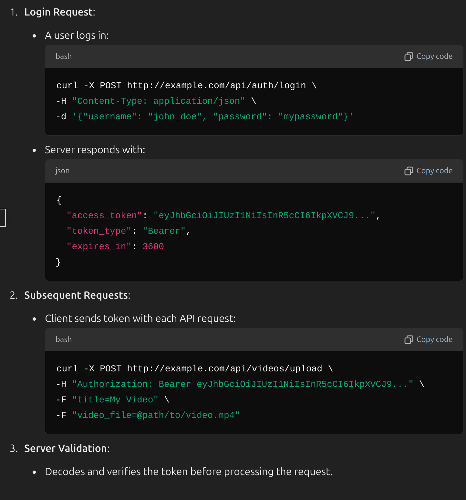
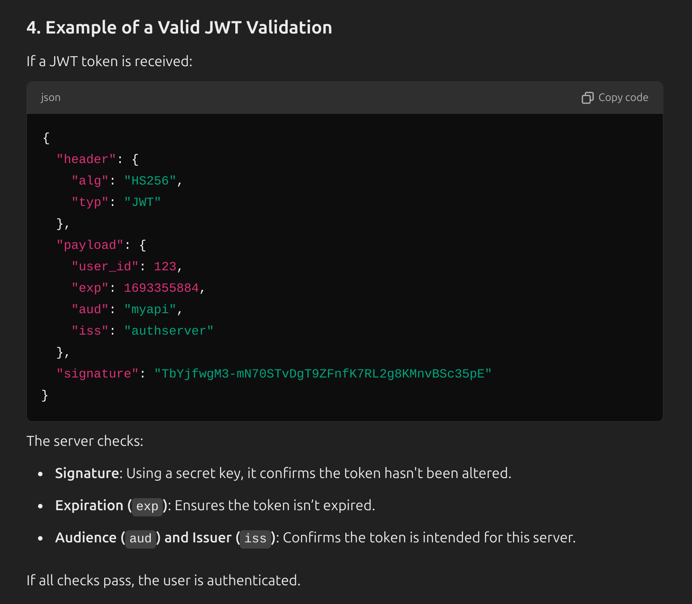

**Q) Let's say that we will design tiktok and we want to implement the video uploading functionality. How does the authorization will be handled?**

**Q) How does server checks if this bearer token is valid or not?**

**Q) How does this bearer token flows through internet?**
