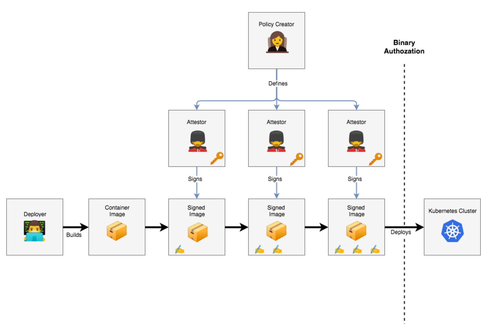
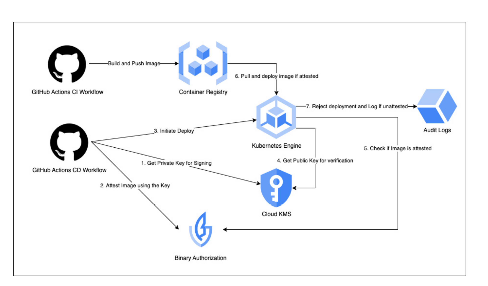

> Binary authorization is a deploy-time security mechanism that ensures that only trusted binary files are deployed within your environments. In the context of containers and Kubernetes, binary authorization uses signature validation and ensures that only container images signed by a trusted authority are deployed within Kubernetes cluster. 
> 
> In our case, terraform needs to have access getPrivateKey for signing operation. Plus, it also needs to have permission to get public key for verification.

```bash
# Service account resource has to have these iam permissions in order to successfully complete necessary deployments
gcloud projects add-iam-policy-binding $PROJECT_ID --member="serviceAccount:terraform@$PROJECT_ID.iam.3gserviceaccount.com" --role="roles/cloudkms.publicKeyViewer"


gcloud projects add-iam-policy-binding $PROJECT_ID --member="serviceAccount:terraform@$PROJECT_ID.iam.gserviceaccount.com" --role="roles/cloudkms.cryptoOperator"
```
---
```bash
# Check if an image is attested or not
gcloud beta container binauthz attestations list --attestor-project=sba-project-1923 --attestor=quality-assurance-attestor --artifact-url=docker.io/tunacinsoy/sba-frontend@sha256:466ef8f59a7ef5081334c0e4082a2c16f01e251eaa08c94d803aeb0ed9684fd6
```
---
```bash
# Sign an image
gcloud beta container binauthz attestations sign-and-create --artifact-url="${image_to_attest}" --attestor="${{ secrets.ATTESTOR_NAME }}" --attestor-project="${{ secrets.PROJECT_ID }}" --keyversion-project="${{ secrets.PROJECT_ID }}" --keyversion-location="${{ secrets.KMS_KEY_LOCATION }}" --keyversion-keyring="${{ secrets.KMS_KEYRING_NAME }}" --keyversion-key="${{ secrets.KMS_KEY_NAME }}" --keyversion="${{ secrets.KMS_KEY_VERSION }}"
```
