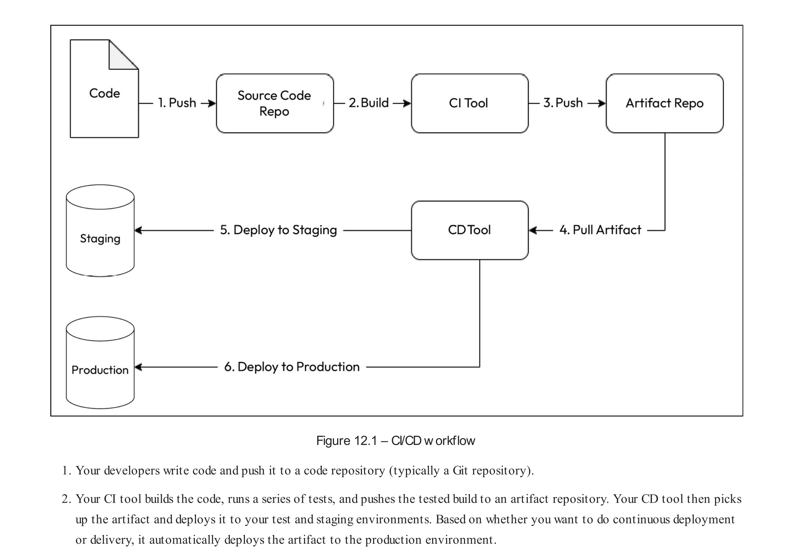
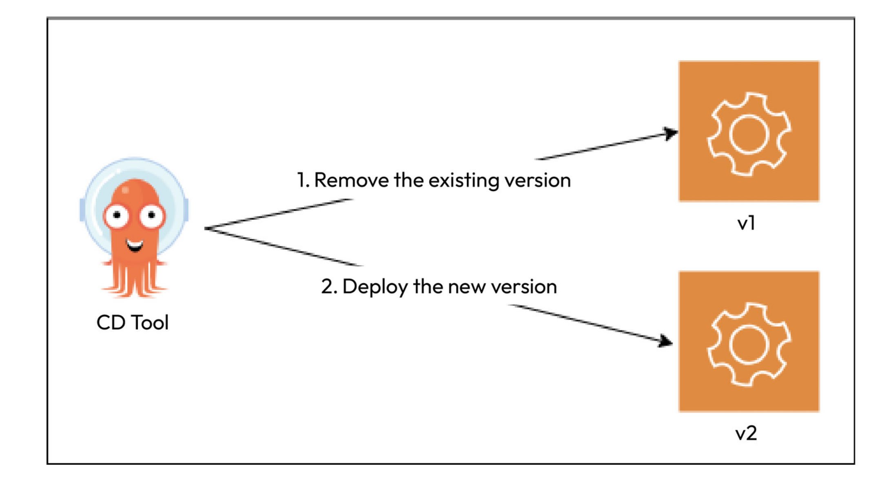
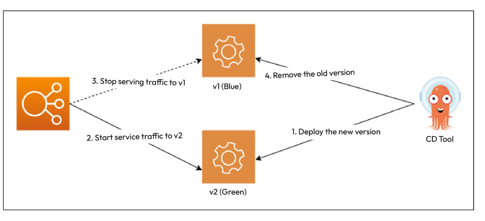
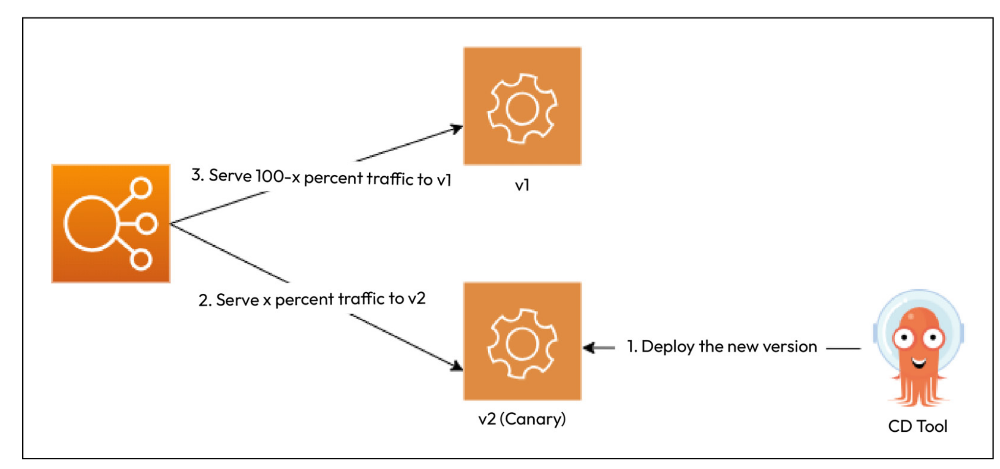
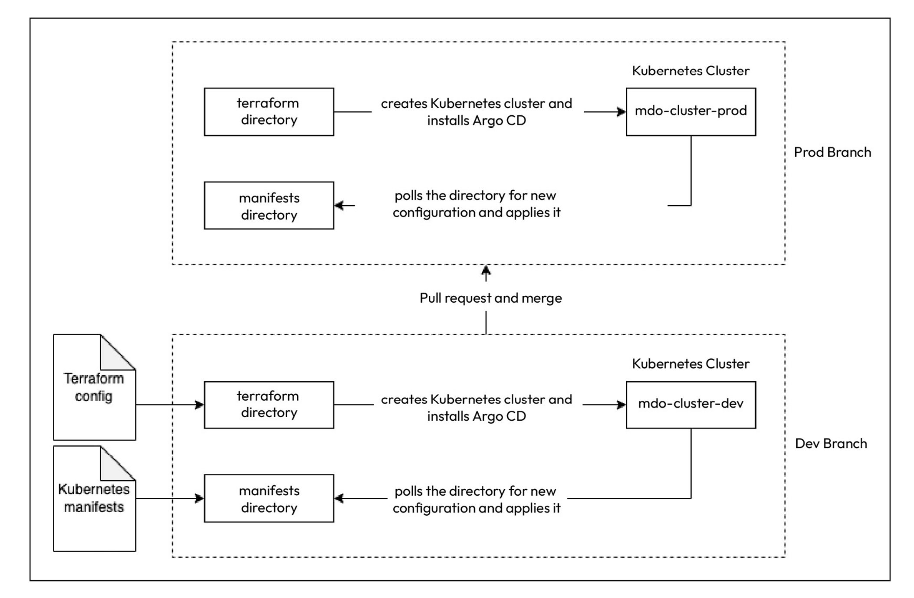
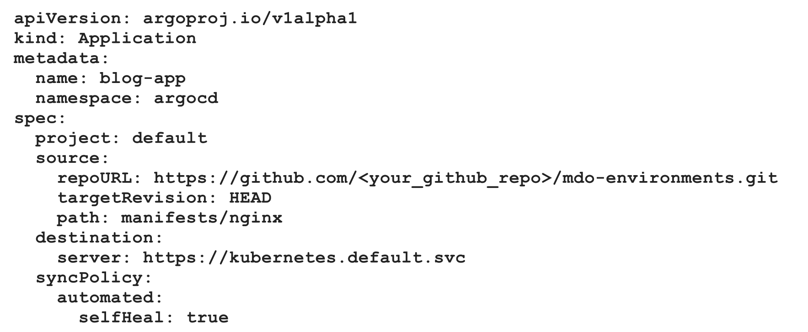
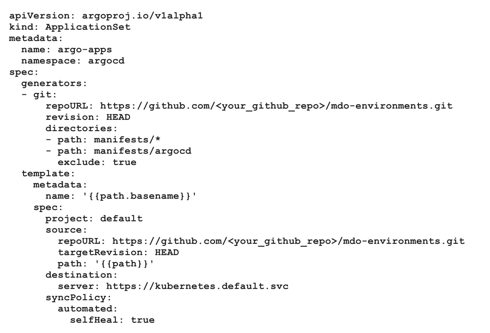
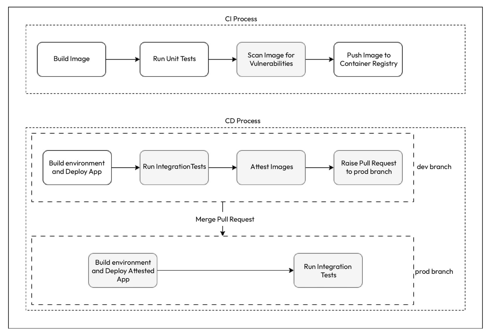

> CI is the first thing most organizations implement when they embrace DevOps, but things don’t end with CI, which only delivers a tested build in an artifact repository. Instead, we would also want to deploy the artifact to our environments.
> 

> With **continuous delivery**, standard tooling can deploy code to higher environments based on certain gate conditions. CD pipelines will trigger when a tested build arrives at the artifact repository or, in the case of GitOps, if any changes are detected in the Environment repository. Environment repository will contain terraform files, kubernetes deployment files etc. (files that are related with environment infrastructure). When an artifact (image) is created successfully, new image tags should be updated in related k8s deployment files. **Continuous delivery enables your team to deliver tested code in your environment based on a human trigger.** So, while you don’t have to do anything more than click a button
> to do a deployment to production, it would still be initiated by someone at a convenient time (a maintenance window).
> 

> **Note**: **Continuous deployments** go a step further when they integrate with the CI process and will start the deployment process as soon as a new tested build is available for them to consume. **In continuous deployments, there is no need for manual intervention, and continuous deployment will only stop in case of a failed test.**
> 

> **Note**: Typical CI/CD workflow looks like the following diagram:
> 
> 

> Simple Deployment Model follows the most straightforward deployment approach. We remove the older version, and deploy the newer one. Following image shows simple deployment model. This is not the desired deployment model, since it comes with the necessity of experiencing downtime, and these disruptions cause damage to defined slo and sla levels.
> 
> 

> **Note**: **Blue/Green Deployments** (also known as Red/Black deployments) roll out the new version alongside old version. After doing sanity checks on newer version, we can switch the traffic to the new version.
> **Q**: What are sanity checks?
> * Sanity checks are essential for providing quick validation of an application's basic functionality after changes. For deployed APIs:
> 	* Ensuring that the API server is up and responding.
> 	- Checking that key endpoints return the expected status codes.
> 	- Verifying that basic CRUD operations are functional
> Following image shows the architecture of blue/green deployments.
> 
> 

>  **Canary deployments** are similar to Blue/Green deployments but are generally utilized for risky upgrades. So, like Blue/Green deployments, we deploy the new version alongside the existing one. Instead of switching all traffic to the latest version at once, we only switch traffic to a small subset of users. As we do that, we can understand from our logs and user behaviors whether the switchover is causing any issues. This is called **A/B testing**. When we do A/B testing, we can target a specific group of users based on location, language, age group, or users who have opted to test Beta versions of a product. Following image shows the architecture of canary deployments.
> 
> 

**Q**: Why do we need another type of tool to enable continuous deployment? Can't we just do it GitHub Actions, for instance?
* TO-DO


> **Note**: Environment repository will hold terraform config files and kubernetes manifest files. Terraform config files will create kubernetes cluster, and install argocd. Argocd will detect any changes (via polling) in kubernetes manifest files, and apply these changes to k8s cluster. Repository will have two branches, named as `prod` and `dev`. Following diagram shows the steps of these deployment process:
> 
> 

> If someone manually changes a resource outside of Git, Argo CD will detect the drift between the Git repository and the live state of the cluster. It will flag the application as "OutOfSync." Depending on the configuration, Argo CD can automatically correct the drift by reverting the manual changes to match the state defined in Git (auto-sync), or it can notify the user to take action and manually sync the application to reconcile the state.

> **Note**: To manage applications declaratively, Argo CD uses the **Application** resource. An Application resource defines the configuration required for Argo CD to access Kubernetes deployment configuration stored in the Git repository using the **source** attribute and where it needs to apply them using the **target** attribute. Following image shows a sample Application resource. (spec.source.targetRevision will be updated with the branch name during workflow)
> However, for each application that we want Argo CD to manage, we need to create separate Application manifests, which brings toil and it is cumbersome. (We also need to indicate them in terraform files). That's why, Argo CD has another manifest type called **ApplicationSet**. Sample one can be seen down below.

> However, for each application that we want Argo CD to manage, we need to create separate Application manifests, which brings toil and it is cumbersome. (We also need to indicate them in terraform files). That's why, Argo CD has another manifest type called **ApplicationSet**. Sample one can be seen down below.
> 
> 
> 

```bash
# After initial deployment of argocd, default password is generated. With these commands, we are creating new password for the log-in.

kubectl patch secret argocd-secret -n argocd \
-p '{"data": {"admin.password": null, "admin.passwordMtime": null}}'

# This effectively clears the admin password, triggering Argo CD to regenerate it the next time the `argocd-server` starts.
kubectl scale deployment argocd-server --replicas 0 -n argocd

kubectl scale deployment argocd-server --replicas 1 -n argocd

kubectl -n argocd get secret argocd-initial-admin-secret \
-o jsonpath="{.data.password}" | base64 -d && echo

```

> 
> **Note**: To be able to answer to following questions, traditional CI/CD process should be updated as follows.
> * How do I scan a container image for vulnerabilities? (Grype)
> * How do I store and manage sensitive information and secrets securely? (ExternalSecrets Resource or SealedSecrets)
> * How do I ensure that my application is tested before deployment to production? (Integration Tests)
> * How do I ensure that only tested and approved container images are deployed in production? (Binary Authorization / Attestation)
> 
> 

> **Note**: It's generally best practice to run unit tests before the image creation. This ensures that any issues are caught early in the process, preventing the creation and deployment of Docker images with potential bugs. If the tests fail, the CI pipeline will stop, saving time and resources.
> 
> ```yaml
> name: Build and Test App
> 
> on:
>   push:
>     branches: [ main ]
>   pull_request:
>     branches: [ main ]
> 
> jobs:
>   build:
>     runs-on: ubuntu-latest
> 
>     steps:
>     - uses: actions/checkout@v2
>     
>     - name: Set up Python
>       uses: actions/setup-python@v4
>       with:
>         python-version: '3.x'
> 
>     - name: Install dependencies
>       run: |
>         python -m pip install --upgrade pip
>         pip install -r requirements.txt
>         pip install pytest
> 
>     - name: Run unit tests
>       run: |
>         pytest app-test.py
> 
>     - name: Install Grype
>       id: install-grype
>       run: curl -sSfL https://raw.githubusercontent.com/anchore/grype/main/install.sh | sh -s -- -b /usr/local/bin
> 
>     - name: Login to Docker Hub
>       id: login
>       run: docker login -u ${{ secrets.DOCKER_USER  }} -p ${{ secrets.DOCKER_PASSWORD }}
> 
>     - name: Build the Docker image
>       id: build
>       run: docker build . --file Dockerfile --tag ${{ secrets.DOCKER_USER  }}/mdo-posts:$(git rev-parse --short "$GITHUB_SHA")
> 
>     - name: Scan Image for Vulnerabilities
>       id: vul-scan
>       run: grype -f critical ${{ secrets.DOCKER_USER  }}/mdo-posts:$(git rev-parse --short "$GITHUB_SHA")
> 
>     - name: Push the Docker image
>       id: push
>       run: docker push ${{ secrets.DOCKER_USER  }}/mdo-posts:$(git rev-parse --short "$GITHUB_SHA")
> ```


