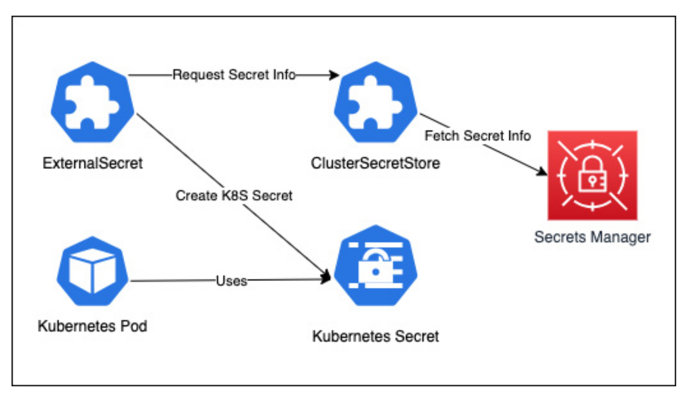

> [!NOTE] What is External Secrets?
> External Secrets Operator serves as a bridge between the Kubernetes cluster and external secret management systems. We define an ExternalSecret custom resource within the Kubernetes cluster, which the operator monitors. When an ExternalSecret resource is created or updated, the operator interacts with the external secret store specified in the ClusterSecretStore CRD to retrieve the secret data. It then creates or updates the corresponding Kubernetes Secrets.
> 
> 

```bash
# Create a Service Account within GCP for ClusterSecretStore Resource to Access External Secrets stored in Secret Manager
gcloud iam service-accounts create external-secrets --description="External-Secrets GKE Service Account" --display-name="External-Secrets Service Account"

gcloud secrets add-iam-policy-binding external-secrets \
--member "serviceAccount:external-secrets@$PROJECT_ID.iam.gserviceaccount.com" \
--role "roles/secretmanager.secretAccessor"

gcloud iam service-accounts keys create external-secrets-service-account.json --iam-account=external-secrets@$PROJECT_ID.iam.gserviceaccount.com
```
