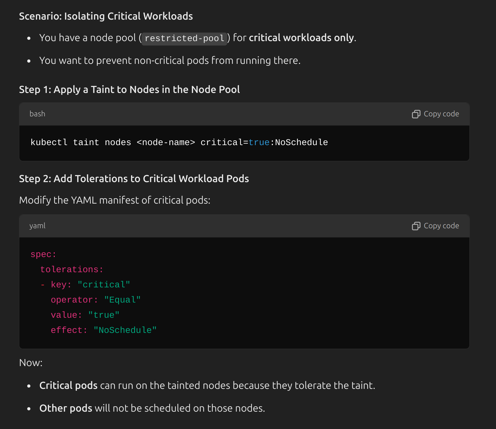

```bash
# configure gcloud settings, including favorite region/zone selection, which project we are operating on etc.
gcloud init
``` 
---
```bash
# Enable compute API
gcloud services enable compute.googleapis.com
``` 
---
```bash
# See billing accounts 
gcloud beta billing accounts list
```
---
```bash
# See all projects
gcloud projects list
```
---
```bash
# See billing accounts 
gcloud beta billing accounts list

# Link billing account with a project
gcloud beta billing projects link <project_id sba-project-7799> --billing-account=<billing_account_id 01B13D-7824D2-1CB36A>

```
---
```bash
# Enable necessary APIs
gcloud services enable iam.googleapis.com \
container.googleapis.com \
binaryauthorization.googleapis.com \
containeranalysis.googleapis.com \
secretmanager.googleapis.com \
cloudresourcemanager.googleapis.com \
cloudkms.googleapis.com \
serviceusage.googleapis.com

```
---
```bash
# Set the default zone for following operations. Check https://cloud.withgoogle.com/region-picker/ for latency and price, then https://cloud.google.com/compute/docs/regions-zones to pick which zone to choose. (Regions have multiple zones, suffixed by 'a', 'b' etc. For instance, 'us-central1-a')
gcloud config set compute/zone <zone_identificator>
``` 
---
```bash
# List current configs, account mail, project_id, default zone etc. 
gcloud config list
```
---
```bash
# to edit the configurations of gcloud
nvim /home/tuna/.config/gcloud/configurations/config_default
```
---
```bash
# Create a gke cluster with the specifications above. Interesting fact, instead of zone, if we provide region, some quota limits are getting triggered. However, if we explicitly specify the zone, it does not happen.
 gcloud container clusters create <cluster_name> \
    --num-nodes=<num_of_nodes> \
    --enable-autoscaling \
    --min-nodes=<min_node_num> \
    --max-nodes=<max_node_num> \
    --zone=<zone_id,(me-west1-b)> \
    --machine-type=<machine_id, (e2-medium)> \
    --disk-size=<disk_size, 10GB>
```
---
```bash
# set the current kubectl context to the gke cluster (get context)
gcloud container clusters get-credentials <cluster_name sba-cluster-dev> --location=<cluster_zone europe-central2-b>
```  
---
```bash
# list all gke clusters
gcloud container clusters list
```` 
---
```bash
# delete gke cluster
gcloud container clusters delete [CLUSTER_NAME] --zone [ZONE]
``` 
---
```bash
# create a disk for persistent volume
gcloud compute disks create <disk_name> --size <size_in_gigabytes 50gb> --type <type_of_disk (pd_ssd) --zone <gke_zone>
``` 
---
```bash
# delete disk
gcloud compute disks delete <disk_name> --zone <zone_id>`
``` 
---
```bash
# ssh into vm/node
gcloud compute instances list

gcloud compute ssh <node_id> --zone=europe-central2-b
``` 
---
```bash
# list all of the images available to spin up vm
gcloud compute images list
```
---
```bash
# To spin up vm
gcloud compute instances create my-vm-instance \
  --zone=me-west1-b \
  --machine-type=e2-medium \
  --image-family=ubuntu-2404-lts-amd64 \
  --image-project=ubuntu-os-cloud \
  --boot-disk-size=10GB
```
---
```bash
# To get the vms in in current context (project).
gcloud compute instances list
```
---
```bash
# Create a gcs bucket.
gcloud storage buckets create gs://<gcs_bucket_name tf-state-sba-terraform-${PROJECT_ID}> --location=<location europe-central2>

```
---
```bash
# Delete the project
gcloud projects delete <PROJECT_ID>
```

> 
> ```hcl
> terraform {
>   backend "gcs" {
>     bucket = "my-terraform-states"
>     prefix = "sba-terraform"
>   }
> }
> ```
> 
> In this example:
> - **`bucket = "my-terraform-states"`**: The state file will be stored in the Google Cloud Storage bucket named `my-terraform-states`.
> - **`prefix = "sba-terraform"`**: The state file will be stored under a "directory" (which is really just a prefix) named `sba-terraform` within the bucket.
> 
> If Terraform state file is named `terraform.tfstate`, the actual storage path in GCS might look like this:
> 
> ```
> my-terraform-states/sba-terraform/terraform.tfstate
> ```
> 
> With that way, we can store different terraform state files for different applications in a single bucket. For instance, following structure would be more understandable for distinguishing.
> ```
> my-terraform-states/some-random-app-terraform/terraform.tfstate
> my-terraform-states/sba-terraform/terraform.tfstate
> ```
> 

```bash
# Create service account for terraform, add iam policy (container.admin is required for the operations on gke cluster, such as deploying argocd using kubectl provider; and also cryptoOperator is necessary for accessing public key in cloud KMS), and retrieve the credentials in a file named key-file.

PROJECT_ID=<project_id sba_project_1907>
gcloud iam service-accounts create terraform \
--description="Service Account for Terraform" \
--display-name="Terraform"

gcloud projects add-iam-policy-binding $PROJECT_ID \
--member="serviceAccount:terraform@$PROJECT_ID.iam.gserviceaccount.com" \
--role="roles/editor"

gcloud projects add-iam-policy-binding $PROJECT_ID \
--member="serviceAccount:terraform@$PROJECT_ID.iam.gserviceaccount.com" \
--role="roles/container.admin"

gcloud projects add-iam-policy-binding $PROJECT_ID --member="serviceAccount:terraform@$PROJECT_ID.iam.gserviceaccount.com" --role="roles/cloudkms.cryptoOperator"

gcloud iam service-accounts keys create key-file \
--iam-account=terraform@$PROJECT_ID.iam.gserviceaccount.com

#Optional
export GOOGLE_APPLICATION_CREDENTIALS="/path/to/your/key-file.json" 

```
---
``` bash
# Create secret in Google Cloud's Secret Manager named `external-secrets`, storing the MongoDB root username and password in the `me-west1` region with a user-managed replication policy.

# To create an external secret in secret manager
echo -n '{"MONGO_INITDB_ROOT_USERNAME": "rootAdmin", "MONGO_INITDB_ROOT_PASSWORD": "P433sw0rd123!"}' | gcloud secrets create external-secrets --locations=europe-central2 --replication-policy=user-managed --data-file=-

# To update an existing secret in secret manager
echo -n '{"MONGO_INITDB_ROOT_USERNAME": "rootAdmin", "MONGO_INITDB_ROOT_PASSWORD": "P433sw0rd123!"}' | gcloud secrets versions add external-secrets --data-file=-

```
---
```bash
# List service accounts
gcloud iam service-accounts list

# Delete service account.
gcloud iam service-accounts delete <service_account_email external-secrets@sba-project-1907.iam.gserviceaccount.com>

```
---
```bash
# List given permissions to a service account
gcloud projects get-iam-policy $PROJECT_ID --filter="bindings.members:serviceAccount:terraform@$PROJECT_ID.iam.gserviceaccount.com"
```
---
```bash
# List all secrets
gcloud secrets list

# Delete secret
gcloud secrets delete [SECRET_NAME]
```
---
``` bash
# Create node pool with applied taint
gcloud container node-pools create restricted-pool \
--cluster=my-cluster \ 
--node-taints=special=true:NoSchedule

```
---
**Q)** How to enable some pods to be only run on specific nodes?
 Use cases are some critical workloads, or maybe some pods that need some node isolation from the rest of the cluster etc.
Think of a node with a taint as a **VIP lounge**:

- The lounge (node) has a "no entry" sign for regular visitors (pods).
- Only guests (pods) with a VIP badge (toleration) are allowed to enter.

This system ensures that only the right pods are scheduled on specific nodes, enabling better resource isolation and control.

---


