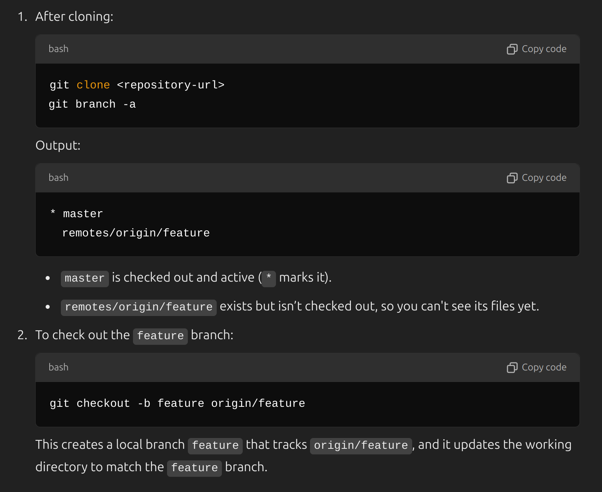

```bash
# To see which branches are merged in remote repository.
git branch --merged
``` 
---
```bash
# delete a branch in local repository, do it after the remote repository is merged.
git branch -d <branch_name>
``` 
---
```bash
# Create a new local branch.
git branch <branch_name>
```
 ---
 ```bash
# Switch to another local branch
git checkout <branch_name>
```
---
``` bash
# If we want to add some changes into latest commit, `--amend` flag should be used.
git add .
git commit --amend 
```
---
```bash
# To delete the last local commit, and turn back to previous commit.
git reset --hard HEAD~1
```
---
> [!NOTE]
> **Note:** In Git, `origin` is the default name for a remote repository from which a local repository was cloned. It serves as a shorthand reference to that remote repository. Common uses of `origin` in Git commands include:
> 
> - `git push origin branch_name`: Pushes changes from your local branch to the remote branch on the `origin` repository.
> - `git pull origin branch_name`: Fetches changes from the remote branch on the `origin` repository and merges them into your local branch.
> - `git fetch origin`: Fetches all updates from the `origin` repository without merging them.

---
> [!NOTE]
> **Note:** The `--set-upstream` (or `-u`) option in Git is used to set the upstream branch for a local branch. This allows you to link your local branch to a remote branch, making it easier to use `git pull` and `git push` without specifying the remote and branch names every time. Here's how it's typically used:
> 
> - `git push --set-upstream origin branch_name` or `git push -u origin branch_name`: This command pushes the local branch to the specified remote branch on `origin` and sets the remote branch as the upstream for the local branch.
> 
> After setting the upstream branch, you can simply use `git pull` and `git push` without additional arguments, and Git will automatically use the linked remote branch.
> 
> Example:
> ```bash
> # This command sets the `main` branch on the `origin` remote as the upstream for your local `main` branch.
> git push --set-upstream origin main
> ```

---
```bash
# Adds all changes.
git add --all
```
---
```bash
# If .gitignore does not make a file untracked, use this command first to make the file untracked.
git rm --cached <file>
```
---
```bash
# List all branches
git branch -a
```
---
```bash
# To see which of your local branches are linked (tracking) to remote branches
git branch -vv
```
---
```bash
# Fetches all branches from the origin (if master is not the only branchzzzzz)
git fetch --all
```
---
**Q) What do we mean when we say `checkout`?**
In Git, **"checked out"** means that a branch or commit has been selected to be active in your working directory. When you "check out" a branch, Git updates the files in your working directory to match the state of that branch and sets that branch as the one you're currently working on.

---
Q) How can I checkout to a branch that exists on remote, however it's not in my local machine?


---
```bash
# Create a local branch that tracks an origin `origin/feature`, and updates
# the working directory to match the `feature` branch

git branch feature origin/feature
```