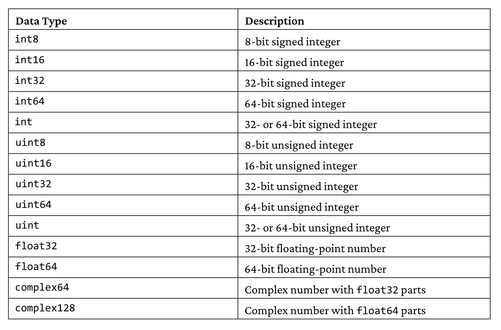
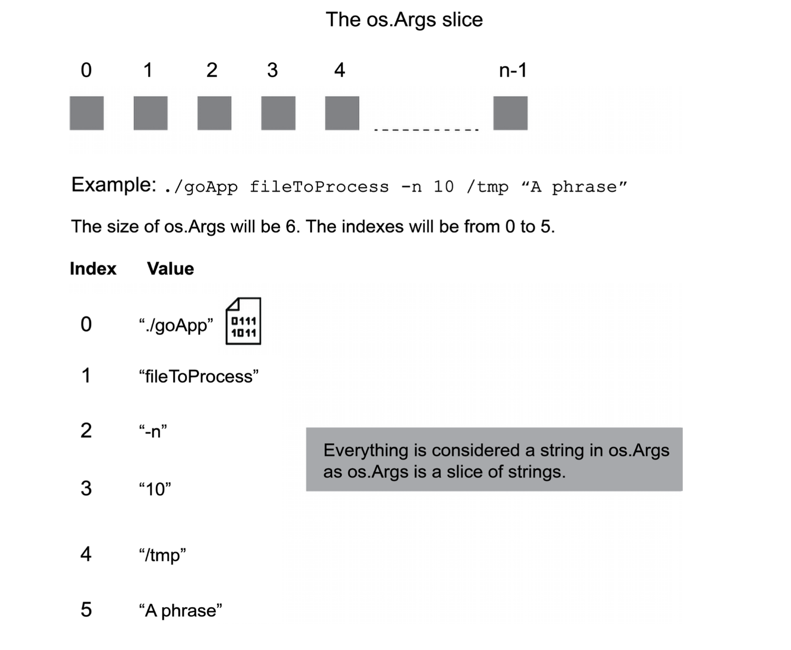
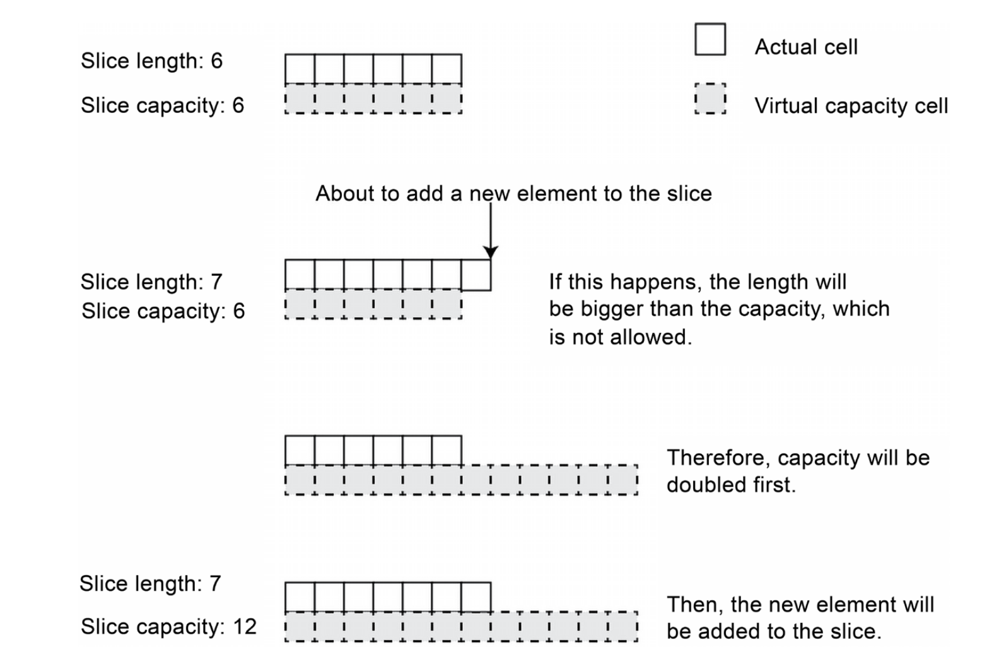
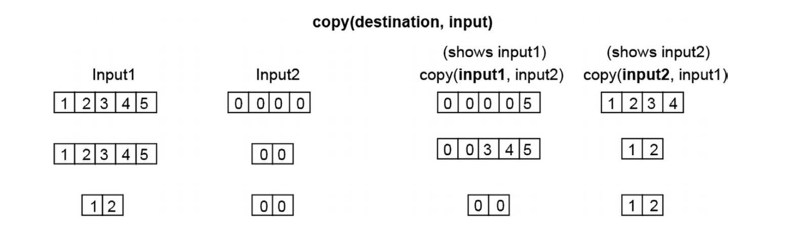
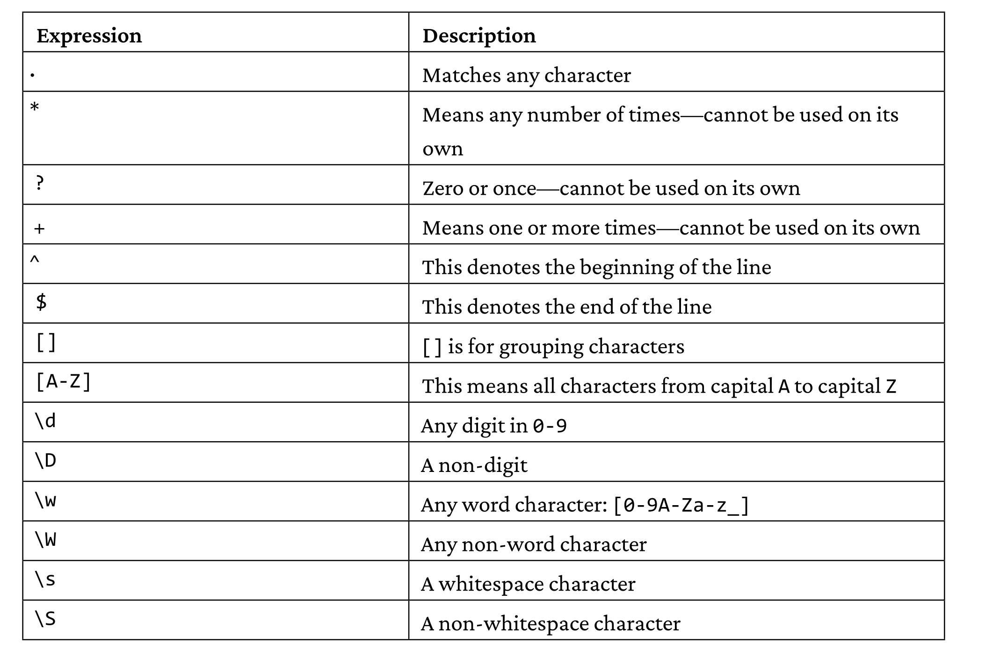
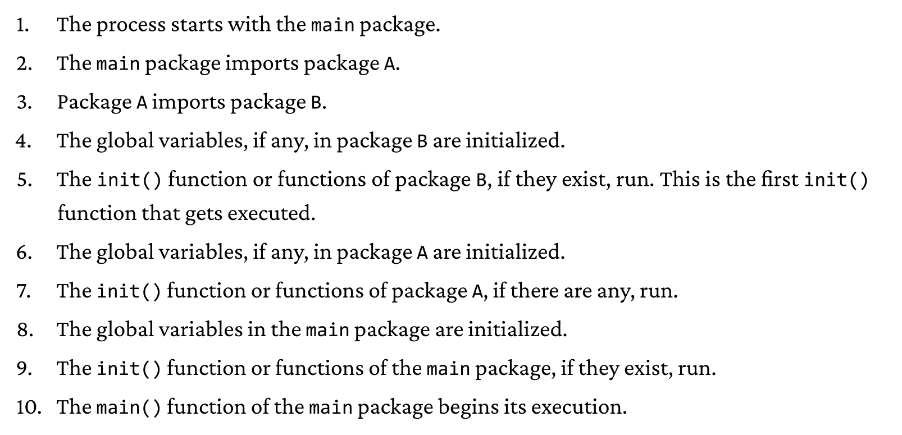
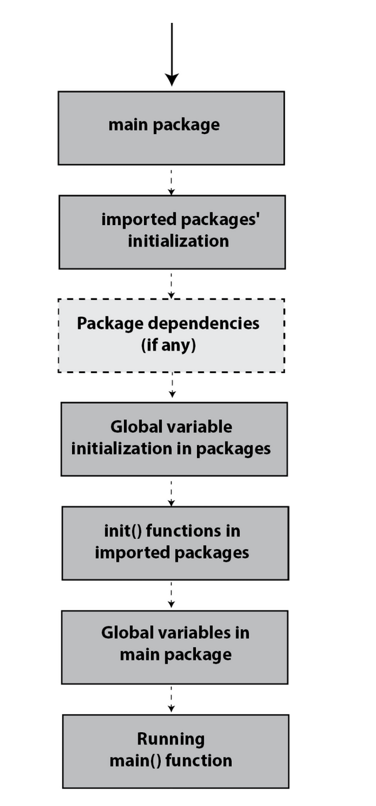

> Go has 15 different numeric types that fall into the three categories: `int`, `float`, and `complex`. That means there are fifteen different ways to describe a number in Go. This includes 11 different integer types, 2 different floating-point types, and 2 different complex number types.
> 
> 

> [!note] What is `defer`?
> We can delay a function call to the end of the current scope by using the `defer` keyword. `defer` tells Go to run a function, but at the end of the current function. This is useful for logging, file writing, and other utilities.

>[!note] How the pointers are handled?
> `var pointerForInt *int`
> 
> In the example above `pointerForInt` will store the address of a variable that has an `int` data type. To break it down further, the `*` operator signifies that this variable will store an address and the `int` portion means that the address contains an integer value.

> 
> In our example, we have our variables: `lyrics` that has the value of `"Moments so dear"` and `pointerForStr` which is a pointer for `lyrics`. Then we use the `*` operator on `pointerForStr` to dereference it and assign a new value of `"Journeys to plan"`. When we check the value of `lyrics` it’s now `"Journeys to plan"`!
> 
> ```go
> lyrics := "Moments so dear"  
> pointerForStr := &lyrics  
>   
> *pointerForStr = "Journeys to plan"  
>   
> fmt.Println(lyrics) // Prints: Journeys to plan
> ```

```go
// How to write `while` loop in go?
for guess != 56 {
	guess = ask()
}

# How to write infinite loop in go? 
for {
	count()
}
```
---
```go

// How to iterate over an array?

letters := []string{"A", "B", "C", "D"}  
for index, value := range letters {  
  fmt.Println("Index:", index, "Value:", value)  
}


// How to iterate over key and value in map data structure?
addressBook := map[string]string{  
  "John": "12 Main St",  
  "Janet": "56 Pleasant St",  
  "Jordan": "88 Liberty Ln",  
}  
for key, value := range addressBook {  
  fmt.Println("Name:", key, "Address:", value)  
}
```
---

>[!note] What is the difference between **slices** and **arrays** in Go?
> Arrays have fixed size, whereas slices have ability to change their size.
> - `arr := [4]int{3,1,4,3}`
> - `sl := []int`
> Notice that we did not specify the length of slice variable.
> 
> When we create a slice variable using the array variable:
> `sl := arr[:]` slice variable also points to the same address that arr points to. So, when we update a variable by using `sl[2] = 2` arr variable also gets updated.

```go
// cap usage in slices
slice := []string{"Fido", "Fifi", "FruFru"}  
// The slice begins at length 3 and capacity 3  
fmt.Println(slice, len(slice), cap(slice))  
// [Fido Fifi FruFru] 3 3  
slice = append(slice, "FroFro")  
// After appending an element when the slice is at capacity  
// The slice will double in capacity, but increase its length by 1  
fmt.Println(slice, len(slice), cap(slice))  
// [Fido Fifi FruFru FroFro] 4 6
```

```go

// When we pass arrays to functions, their values do not change since it is pass by value. However, with slices, we can update the values.
package main

import "fmt"

func main() {

	myTutors := [4]string{"Kirsty", "Mishell", "Jose", "Neil"}

	myTutorsButSlice := myTutors[:]

	modifiedSlice := changeLastElement(myTutorsButSlice, "Bobby")

	fmt.Println("Arr:", myTutors)

	fmt.Println("Slice:", modifiedSlice)

	/*
	
	Arr: [Kirsty Mishell Jose Bobby]
	
	Slice: [Kirsty Mishell Jose Bobby]
	
	*/

}

func changeLastElement(inputSlice []string, inputString string) []string {

inputSlice[len(inputSlice)-1] = inputString

return inputSlice

}
```
---
```go
// Create empty map (when we do not know the content of the map yet)
defaultMap := make(map[string]float32)

// Create a map with known values
donuts := map[string]int{
	"frosted": 10,
	"chocolate": 15,	
	"jelly": 8,
}

// To access value of a key
firstChoice := donuts["frosted"]

// Status has value of false if donuts map does not contain bavarian cream
secondChoice, status := donuts["bavarian cream"]

// Update add key-values
donuts["glazed"] = 12 // If there is "glazed" then it is value will be 12
// If not then it will be added to the map

// Delete key-value pair
delete(donuts,"chocolate")
```
---
```go

// Define struct
type Pet struct {
	name string
	petType string	
	age int
}

// Initialize a struct
nuggets := Pet{"Nuggets", "dog", 4}
```
---
```go
// Pointers Recap

// Defining a string variable called 'val'
val := "Tuna"

//valPtr becomes a string pointer that holds the address of 'val' 
valPtr := &val // valPtr becomes -> var valPtr *string

fmt.Printf("Type of valPtr is: %T", valPtr) // *string
fmt.Println()

// Printing the value stored in variable 'val'
fmt.Println(val) // Tuna

// Printing the address of 'val' variable 
fmt.Println(valPtr) // 0xc000014070

// Dereferencing, valPtr was a pointer, and when we use '*', it refers to value stored in variable 'val'
fmt.Println(*valPtr) // Tuna

// The address of 'val' variable
fmt.Println(&val) // 0xc000014070
```
---
```bash
# Build go code. 
# If no source files are provided, go build looks for a main package in the current directory.
go build -o HelloWorld hw.go

# This also compiles the code, generates en executable file, executes it and deletes it once it's been run.
go run hw.go
```
---

> Using go run is a better choice when testing code. However, if you want to create
> and distribute an executable binary, then go build is the way to go.

> 
> The `fmt.Scanln()` function is rarely used to get user input. Usually, user input is
> read from command line arguments (os.Args) or external files. However, interactive command line applications need `fmt.Scanln()`.

> 
> 
> 

```go
// %v stands for value, meaning that it would print out the value no matter what the type is, could be int, string, bool etc.
// Useful when we do not know what will be returned.
// Example:
// Reports if the second input is the prefix of the first input
fmt.Printf("Prefix: %T, %v\n", strings.HasPrefix("Tuna", "un"), strings.HasPrefix("Tuna", "un")) // bool, false
```

> In Go, `rune` is an alias for `int32`, which means it is a 32-bit integer used to represent Unicode code points.

> **const** variables are getting their values during the **compile time**. This can be expressed like the following:
> ```go
> const PI = 3.14
> ```
> Gets converted into:
> ```x86
> MOVSD xmmm0, 3.14
> ```
> Since the value of PI will remain the same throughout the execution, the value of its are already known at compilation.
> 
> However, **variables** in Go are getting their values during **program execution**. Because, a value of a variable might depend on a return value of a function, thus we need to execute the program to find out its actual value.
> ```go
> 
> func foo(x int) int {
> 	return 2 * x
> }
> 
> func main() {
> 	y := foo(4) // I do not know the value of y until the program gets executed
> }
> ```

> - When defining an array variable, you must define its size. Otherwise, you should put
> [...] in the array declaration and let the Go compiler find out the length for you. So you
> can create an array with 4 string elements either as:
> 	-  `[4]string{"Zero", "One", "Two","Three"}` or 
> 	- `[...]string{"Zero", "One", "Two", "Three"}`. 
>  If you put nothing in the square brackets, then a slice is going to be created instead. As it contains four elements, the (valid) indexes for that array are 0, 1, 2, and 3.
>  - You cannot change the size of an array after you have created it.

> A slice value is a header that contains a pointer to an underlying array where the elements are actually stored, the length of the array, and its capacity.
> ```go
> type SliceHeader struct {
> 	Data uintptr // pointer to the underlying array 
> 	 // (a slice is implemented using an underlying array)
> 	Len int // length
> 	Cap int // capacity
> }
> ```

> 
> 

> 
> As Go does not have a data type for storing single characters, it uses byte and rune for
> storing character values. A single byte can store a single ASCII character only whereas
> a rune can store Unicode characters. As a result, a rune can occupy multiple bytes.
> 
> `rune` is an alias for `int32`, whereas `byte` is an alias for `uint8`. So, a rune can contain ascii characters as well as unicode characters.

> - **`[]byte`**: Use when working with ASCII text, binary data, or when performance and memory usage are concerns (since `byte` is more compact).
> - **`[]rune`**: Use when dealing with text that may include non-ASCII characters, such as characters from different languages or special symbols, because `rune` can represent any Unicode character.
>  
>  
> - If you only need to handle simple English text, `[]byte` is sufficient.
> - For internationalization or dealing with diverse character sets, `[]rune` is necessary.

> 
> 

 > Slices are passed to functions without the need to use a pointer—it is Go that
> passes the pointer to the underlying array of a slice and there is no way to change that behavior.

> The general idea is that if an array or a slice cannot do the job, you might need to look at maps. If a map cannot help you store your data the way you want, then you should consider creating and using a structure.

> 
> Characters presented in the table are used for constructing and defining the grammar of a regular expression.

> Generic programming is a programming paradigm that allows the developer to implement a function using one or more data types that are going to be provided at a later time.
> 
> Generics is a feature that allows you the capability of not precisely specifying the data type of one or more function parameters, mainly because you want to make your functions as universal as possible.

> When you see `list[T any]`, you should **not** think about arrays or slices, even though the syntax looks similar to defining slices or arrays.
> ### Differences:
> 
> - **Slices/Arrays**:
>     
>     - In Go, you define slices or arrays like this: `[]T` (slice of type `T`) or `[N]T` (array of type `T` with length `N`).
>     - These are built-in, contiguous memory structures that allow indexed access to elements.
> - **Generic Structs (like `list[T any]`)**:
>     
>     - Here, `list[T any]` is a **generic type** where `T` is a placeholder for any type. The `any` constraint means that `T` can be of any type.
>     - It’s not an array or a slice. In your example, `list[T any]` is a **custom data structure** (a linked list) where nodes are connected through pointers (`next`), not stored contiguously in memory like slices/arrays.
> 
> ### Think of it this way:
> 
> - Arrays/Slices = Contiguous blocks of memory, accessed via indices.
> - Custom List (`list[T]` in your case) = A chain of elements (nodes), each pointing to the next, accessed via traversal.
> 
> They share the `[T]` syntax for generics and arrays, but conceptually they represent different structures.

```go
// An example for polymorphism in golang
// drawShape function does not care what the shape is, it only accepts a shape,
// and based on the type of shape, correct draw() function is implemented
type Shape interface {
    Draw()
}

type Circle struct{}
type Square struct{}

func (c Circle) Draw() {
    fmt.Println("Drawing a circle")
}

func (s Square) Draw() {
    fmt.Println("Drawing a square")
}

func drawShape(s Shape) {
    s.Draw()
}

func main() {
    c := Circle{}
    s := Square{}

    drawShape(c) // Output: Drawing a circle
    drawShape(s) // Output: Drawing a square
}
```

> Packages are the way of organizing, delivering, and using code. Modules are collections of packages. So, A **module** is a collection of packages, while a **package** is a collection of files.

> 
> 

> GO111MODULE environment variable controls the behavior of whether to check the go.mod and go.sum files. If we set it to on, go compiler will look for the go.mod and go.sum files for dependencies. The default value is auto, which means that if there's a go.mod file there, it will look at it, if not, it will look at GOPATH value which is ~/go/src.

> Go uses os.Stdin to access standard input, os.Stdout to access standard output, and os.Stderr to access standard error.

> Marshaling is the process of converting a Go structure into a JSON record. You usually want that for transferring JSON data via computer networks or for saving it on disk. Unmarshaling is the process of converting a JSON record given as a byte slice into a
> Go structure. You usually want that when receiving JSON data via computer networks or when loading JSON data from disk files.
> 
> The number one bug when converting JSON records into Go structures, and vice versa,
is not making the required fields of your Go structures exported, that is having their
first letter in uppercase. When you have issues with marshaling and unmarshaling,
begin your debugging process from there.

> In Go, the key difference between `any` and `interface{}` is **semantics**, not functionality. Both are effectively the same and are interchangeable, as `any` is just an alias for `interface{}` introduced in Go 1.18 to improve readability and align with modern usage.
> 
> Use `any` for readability in newer Go code. Stick with `interface{}` if maintaining legacy code for consistency.

> When we run `go mod init`, the go.mod file gets created, and once we run `go mod tidy`, the packages that are stated under `import` part of the code gets downloaded, and they are put into `~/go/pkg/mod/github.com/spf13` for viper package, for instance. 
> 
> In the background, what I observe that happens is that the `go mod tidy` command downloads the packages mentioned in the code, just like running `go install github.com/spf13/viper`. 
> 

>  Because cobra-cli is rather than a framework that allows you to create command line interface. We use commands like `cobra-cli init` and `cobra-cli add`, to build the CLI.

