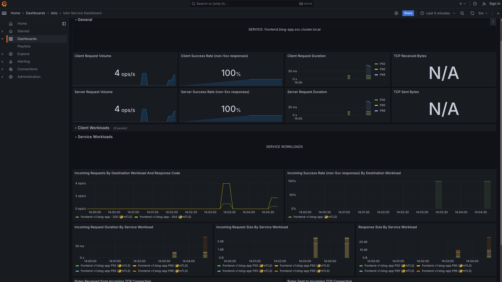
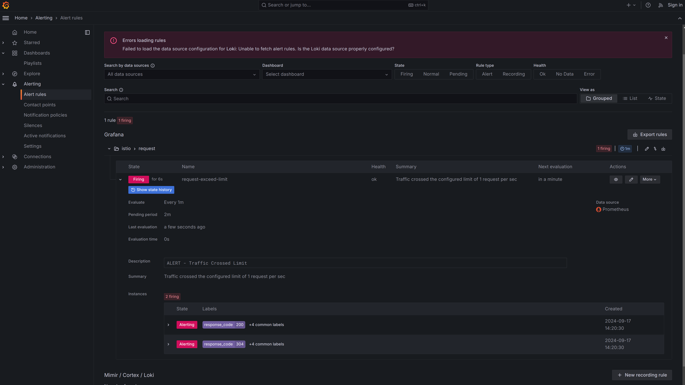

> Grafana is a leading open source platform for observability and monitoring, offering dynamic dashboards and robust alerting capabilities. It enables users to visualize data from diverse sources while setting up alerts for proactive issue detection.
> 
> 
> 
> 
> 
> 

```promql
round(sum(irate(istio_requests_total{connection_security_policy="mutual_tls", destination_service=~"frontend.blog-app.svc.cluster.local", reporter=~"destination", source_workload=~"istio-ingress", source_workload_namespace=~"istio-ingress"}[5m])) by (source_workload, source_workload_namespace, response_code), 0.001)
```
This query determines the traffic rate for all transactions passing through the Istio ingress gateway to the frontend microservice. This query measures the rate of Istio requests (filtered by mutual TLS, specific source and destination, and namespace) over the last 5 minutes, grouped by source workload, namespace, and response code, then rounds the result for cleaner presentation.
