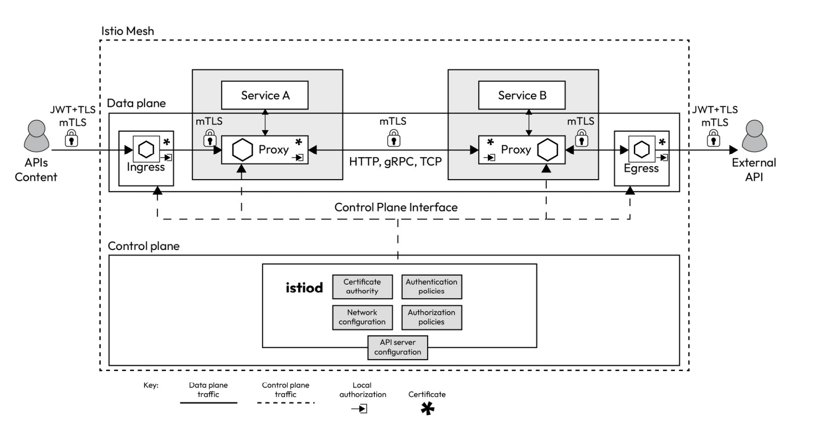
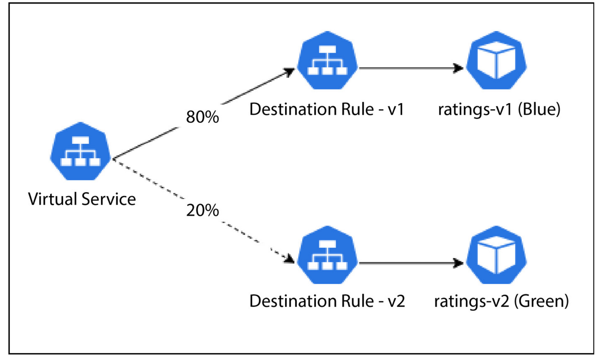
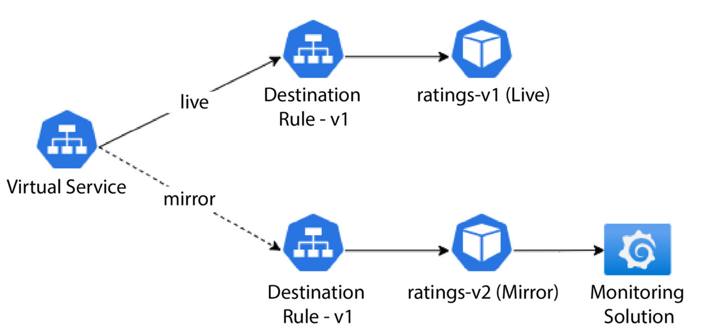

>[!note] Why do we need to use Istio?
> Kubernetes effectively addresses some management issues, it primarily serves as a container orchestration platform and excels in that role. However, it doesn’t inherently solve all the complexities of a microservices architecture as they require specific solutions. Kubernetes does not inherently provide robust service management capabilities.
> 
> Istio steps in by injecting a sidecar container into your pod, which acts as a proxy. Your containers communicate with other containers via this proxy. This architecture allows all requests to flow through the proxy, enabling you to exert control over the traffic and collect data for further analysis. Moreover, Istio provides the means to encrypt communication between pods and enforce identity and access management through a unified control plane.
> 
> Since all of the traffic flows through these envoy proxies, we can observe what's going on inside of the cluster.

> [!note] What is the overall architecture of Istio?
> **Data plane**: This comprises the sidecar envoy proxies that Istio injects into your microservices. These proxies take on the essential role of routing traffic between various services, and they also collect crucial telemetry data to facilitate monitoring and insights.
> **Control plane**: The control plane serves as the command center, instructing the data plane on how to route traffic effectively. It also handles the storage and management of configuration details, making it easier for administrators to interact with the sidecar proxy and take control of the Istio service mesh. In essence, the control plane functions as the intelligence and decision-making hub of Istio.
> 
>  

>[!note] What is the Architecture of `Control Plane`?
> The Istio control plane, or istiod, comprises several critical components, each playing a distinct role in managing your service mesh.
> - **Pilot** serves as the central control hub of the service mesh. It communicates with the envoy sidecars using the Envoy API and translates the high-level rules specified in Istio manifests into envoy configurations. Pilot ensures consistent traffic management.
> - **Citadel** focuses on identity and access management within your service mesh, fostering secure communication between Kubernetes pods. It offers user authentication, credential management, certificate handling, and traffic encryption, ensuring pods can securely validate one another when necessary.
> - **Galley** is responsible for essential configuration tasks within your service mesh. It validates, processes, and distributes configuration changes throughout the Istio control plane.

>[!note] What is the Architecture of `Data Plane`?
>The data plane component of Istio is composed of **envoy proxies**, **ingress gateways,** and **egress gateways**.
> - **Envoy proxies** play a pivotal role in enabling various aspects of your service mesh. These Layer 7 proxies are uniquely capable of making crucial decisions based on the content of the messages they handle, and they are the sole components that directly interact with your business traffic.
> 	- They provide fine-grained control over how traffic flows within your service mesh, allowing you to define routing rules for various types of traffic, including HTTP, TCP, WebSockets, and gRPC.
> 	- Envoy proxies enforce identity and access management, ensuring that only authorized pods can interact with one another. They implement mutual TLS and traffic encryption to prevent man-in-the-middle attacks and offer features such as rate limiting to safeguard against runaway costs and denial-of-service attacks.
> 	- They enhance network resiliency by supporting features such as retries, failover, circuit breaking, and fault injection to maintain the reliability and robustness of your services.
> - In Istio, **ingress** is a collection of one or more envoy proxies, which Pilot dynamically configures upon their deployment. These envoy proxies are crucial in controlling and routing incoming external traffic into your service mesh, ensuring that it is appropriately directed to the relevant services based on defined routing rules and policies. **Egress** gateways are similar to ingress gateways but they work on outgoing traffic instead.

>[!note] What is the `Gateway` Resource and `VirtualService` Resource?
> Istio **gateway** is a custom resource definition (CRD) that helps you define how incoming external traffic can access services in your mesh. It acts as an entry point to your service and a load balancer for incoming traffic. When external traffic arrives at a gateway, it determines how to route it to the appropriate services based on the specified routing rules.
> When we define an Istio gateway, we also need to define a **VirtualService** resource that uses the gateway and describes the routing rules for the traffic. Without a **VirtualService** resource, the Istio gateway will not know where and how to route the traffic it receives. A **VirtualService** resource is not only used for routing traffic from gateways but also for routing traffic within different services of the mesh. It allows you to define sophisticated routing rules, including traffic splitting, retries, timeouts, and more. Virtual services are often associated with specific services or workloads and determine how traffic should be routed to them. You can use virtual services to control how traffic is distributed among different versions of a service, enabling practices such as A/B testing, canary deployments, and Blue/Green deployments.


> [!note] What is the typical flow of user who is trying to access a webpage that is running on k8s with istio?
> Let's imagine we have the following definition `Gateway` CRD applied to k8s cluster: 
> `hosts:` 
> `- "myblog.com"` 
> 
> - **DNS Setup:** You configure `myblog.com` to point to the IP address of your ingress gateway.
>  - **Client Request:** A user types `myblog.com` in their browser, which sends a request to the IP address set up in DNS.
>  - **Gateway Matching:**
>    - The request arrives at the ingress gateway with a `Host: myblog.com` header.
>    - The Istio Gateway checks if `myblog.com` matches any of its configured `hosts`.
>    - If matched, it processes the request; otherwise, it does not.

>[!note] What is `PeerAuthentication` Resource?
>
>By default, Istio provides TLS encryption for communication between workloads
>that have sidecar proxies injected. However, it’s important to note that this default setting operates in compatibility mode. In this mode, traffic between two services with sidecar proxies injected is encrypted. However, workloads without sidecar proxies can still communicate with backend microservices over plaintext HTTP.
>
>To enable strict TLS on a workload, namespace, or the entire cluster, Istio provides peer authentication policies using the `PeerAuthentication` resource.

>[!note] What is `AuthorizationPolicy` Resource?
> `AuthorizationPolicy` enables us to allow or deny the connection between different services within our kubernetes cluster. Since we know the overall architecture of the application, we are aware of which services should have right to receive connection from.

```bash
# Analyze the resources deployed in a given namespace 
istioctl analyze --n blog-app
```
---
> [!Note] What is `DestinationRule` Resource?
> `DestinationRule` defines policies that apply to traffic intended for a service after routing has occurred. These rules specify configuration for load balancing, connection pool size from the sidecar, and outlier detection settings to detect and evict unhealthy hosts from the load balancing pool. 

VirtualServices are like some rulesets that are associated with either services or ingresses in k8s cluster. 

> [!NOTE] What is the Difference Between **VirtualService** and **DestinationRule** resources?
> ### **VirtualService**
> 
> - **Purpose**: Controls the routing of traffic to services within the mesh.
>     
> - **Functionality**:
>     
>     - Defines rules to match and route HTTP, TCP, or gRPC traffic to specific services based on criteria like URI paths, headers, methods, etc.
>     - Allows you to perform traffic splitting (e.g., send 80% of traffic to version `v1` and 20% to version `v2`).
>     - Enables advanced traffic management features like retries, fault injection, timeouts, and mirroring.
>     - Directs external traffic through specified gateways, allowing you to control how users interact with your services.
> - **Use Case**: Define routing behavior based on conditions (like URL paths or headers) and specify what subset of a service should handle the traffic.
> 
> 
> ### **DestinationRule**
> 
> - **Purpose**: Configures how traffic is handled at the destination service.
>     
> - **Functionality**:
>     
>     - Specifies policies for the traffic once it reaches the service, such as load balancing, connection pool settings, circuit breaking, and TLS settings.
>     - Defines subsets of a service based on labels (e.g., versions or environments), which are then used by `VirtualService` for routing decisions.
>     - Controls how traffic is treated at the endpoint, such as enabling mTLS (mutual TLS) for secure communication or setting up outlier detection to eject failing instances.
> - **Use Case**: Define how traffic should be managed at the service level, such as distributing requests evenly among service instances or applying specific security settings.
> 
> ### **Key Differences**
> 
> 1. **Focus**:
>     
>     - **VirtualService**: Focuses on **routing** traffic from a client to a service, managing the flow of traffic based on rules and conditions.
>     - **DestinationRule**: Focuses on **handling** traffic **once it reaches the service**, defining how the service instances should be managed.
> 2. **Routing vs. Policies**:
>     
>     - **VirtualService**: Handles which service or subset of a service the traffic should go to.
>     - **DestinationRule**: Handles how traffic is treated by the service (e.g., applying load balancing, mTLS, or connection policies).
> 3. **Usage Relationship**:
>     
>     - `VirtualService` often references subsets defined in `DestinationRule`. For example, a `VirtualService` may split traffic between subsets `v1` and `v2`, which are defined in the `DestinationRule`.
> 4. **Examples**:
>     
>     - **VirtualService**: Directs 70% of traffic to `v1` of a service and 30% to `v2` based on routing rules.
>     - **DestinationRule**: Configures `v1` and `v2` subsets with specific load balancing or security settings, such as round-robin load balancing or mTLS.


> [!NOTE] What is Canary Roll-out (Canary Deployment)?
> Canary Roll-out, often referred as Blue-Green deployment, is the deployment strategy that allows to deploy the new/updated version alongside the previous version. With the usage of `VirtualService` and `DestinationRule` resources of Istio, incoming traffic can be distributed between these two different versions. If everything goes well, maintainers can incrementally increase the percentage of traffic that is directed to new version.
> 


> [!NOTE] What is Staging Environment and its pros/cons?
> Traditionally, many enterprises maintained a staging environment that closely mimicked the production setup. The Ops team deployed new releases to the staging environment in this setup while testers generated synthetic traffic to simulate real-world usage. This approach provided a means for teams to evaluate how the code would perform in the production environment, assessing its functional and non- functional aspects before promoting it to production. The staging environment served as the ground for performance, volumetric, and operational acceptance testing. While this approach had its merits, it was not without its challenges. Maintaining static test environments, which involved substantial costs and resources, was one of them. Creating and sustaining a replica of the production environment required a team of engineers, leading to high overhead. Moreover, synthetic traffic often deviated from real live traffic since the former relied on historical data,while the latter reflected current user interactions. This  discrepancy occasionally led to overlooked scenarios.

> [!NOTE] How Does Traffic Mirroring Work?
> 1. Deploy a new version of the application and activate traffic mirroring.
> 2. The old version continues to respond to requests as usual but concurrently sends an asynchronous copy of the traffic to the new version.
> 3. The new version processes the mirrored traffic but refrains from responding to end users.
> 4. The ops team monitors the behavior of the new version and reports any issues to the development team.


