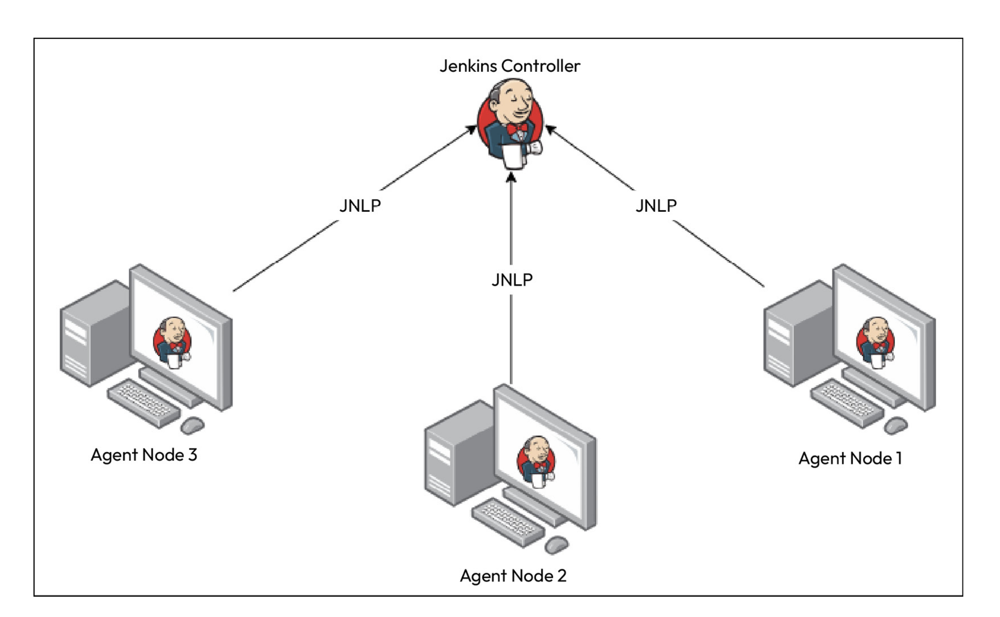
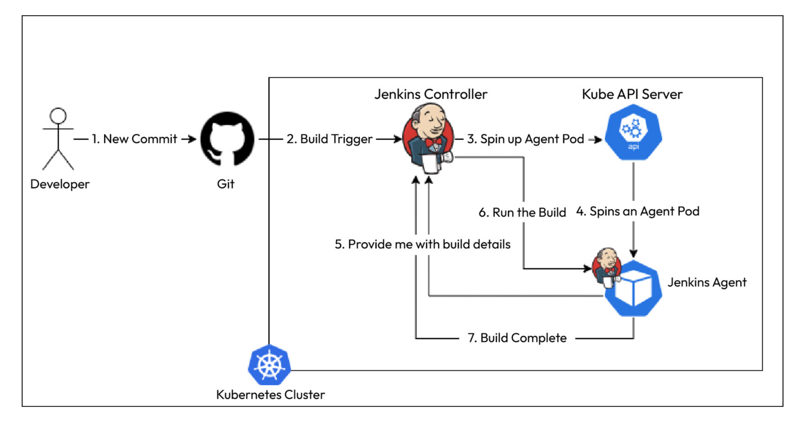

> Jenkins is a widely used automation server that helps automate various tasks, particularly those related to building, testing, and deploying software. It is open-source and Java-based tool with a plugin-based architecture that supports several integrations with source code management (git), and artifact repository (nexus, artifactory), and with also build tools such as ant, maven, gradle.

> kaniko is a tool to build container images from a Dockerfile, inside a container or Kubernetes cluster. kaniko doesn't depend on a Docker daemon and executes each command within a Dockerfile completely in userspace. This enables building container images in environments that can't easily or securely run a Docker daemon, such as a standard Kubernetes cluster. 

> * **Root Access**: The Docker daemon requires root privileges to manage containers, which means it has access to the host's entire file system. This elevated privilege level can be exploited if the daemon is compromised.

> Using containers to build images might sound great, and we can go ahead and run this build, but there are issues with this approach. We must understand that the Jenkins controller and agents run as containers and aren’t full-fledged virtual machines. Therefore, if we want to run a Docker build within the container, we must run the container in privileged mode. This isn’t a security best practice, and your admin should already have turned that off. This is because running a container in privileged mode exposes your host filesystem to the container. A hacker who can access your container will have full access so that they can do whatever they want in your system.

> With Kaniko and Jenkins, we will have a scalable automation server that is running in k8s cluster, and we won't need root privileges to build container images. Thus, it is secure.

> Jenkins follows controller-agent model. It is possible to run workloads on controller agent as well, however, it is a good practice to distribute workloads to offload control agent. Following image shows the architecture.
> 
> 

> * JNLP (Java Network Launch Protocol) is a protocol used for launching Java applications over a network. In the context of Jenkins, JNLP is used to connect agent nodes (also known as Jenkins slaves) to the Jenkins controller.
> * JNLP agent runs on agent nodes, and allows the connection to the controller node.

> **Note**: Whenever we trigger a build on Jenkins, Jenkins instructs Kubernetes to create a new agent container that will then connect with the controller machine and run the build within itself. This is build on-demand at its best. Following diagram shows the on-demand build process with Jenkins in Kubernetes.
> 
> 

