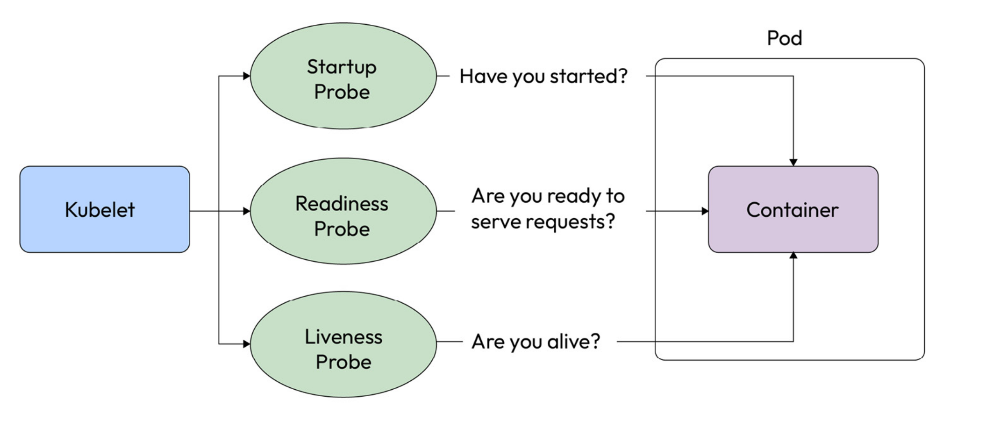
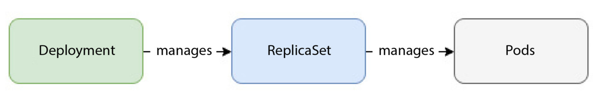
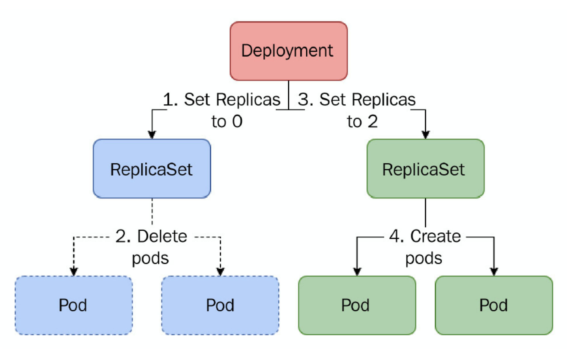
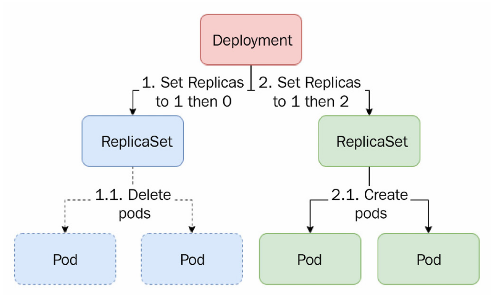
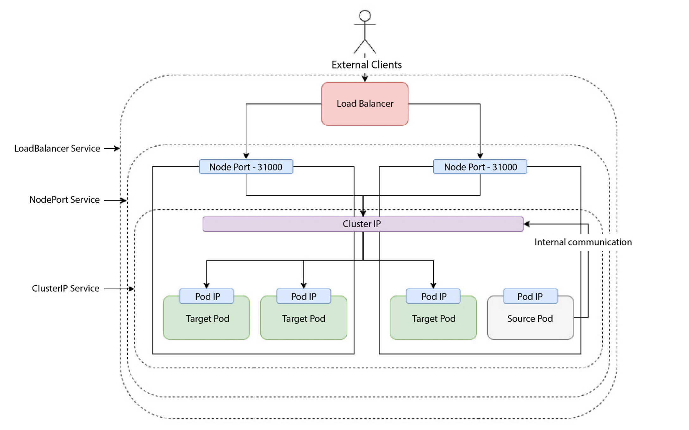
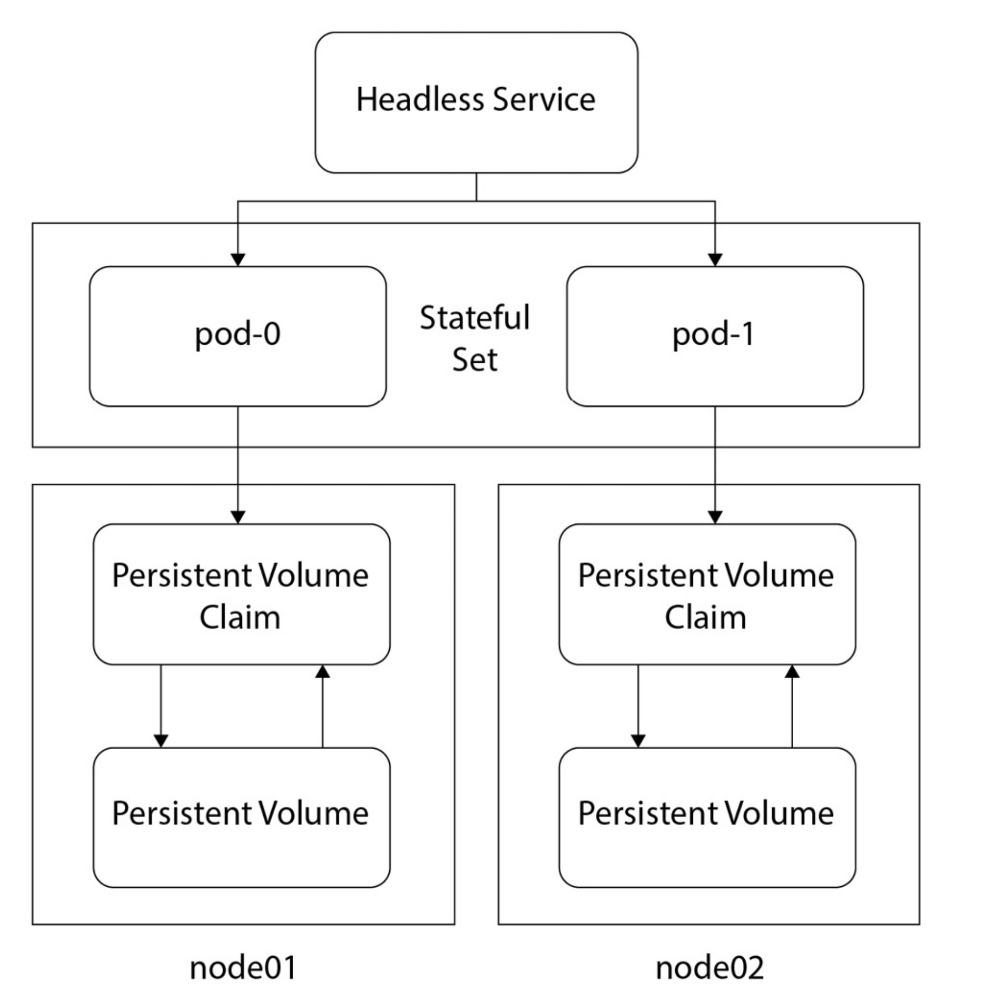
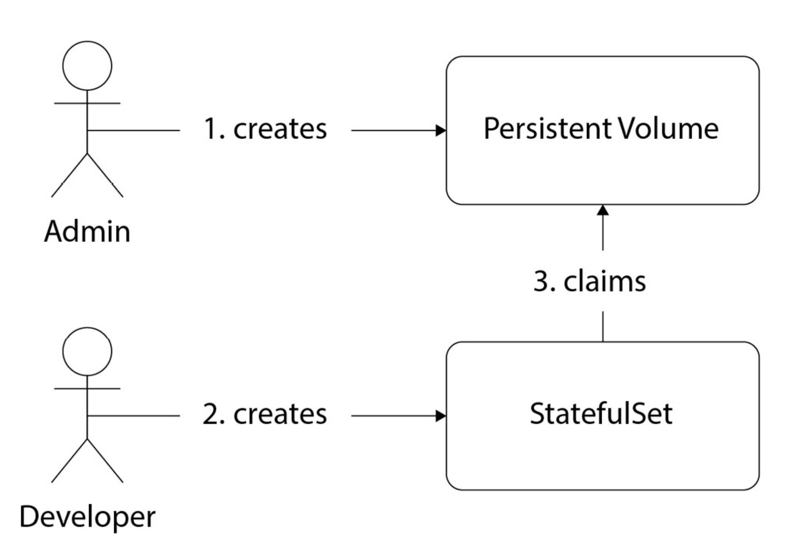
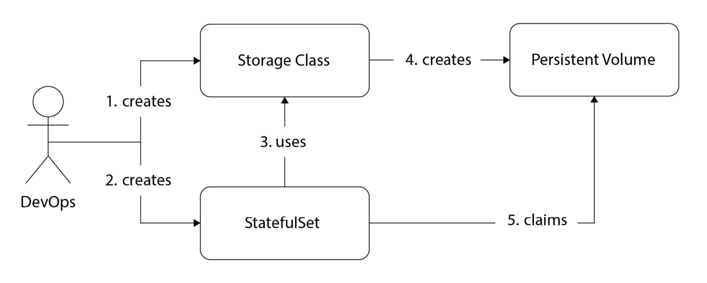
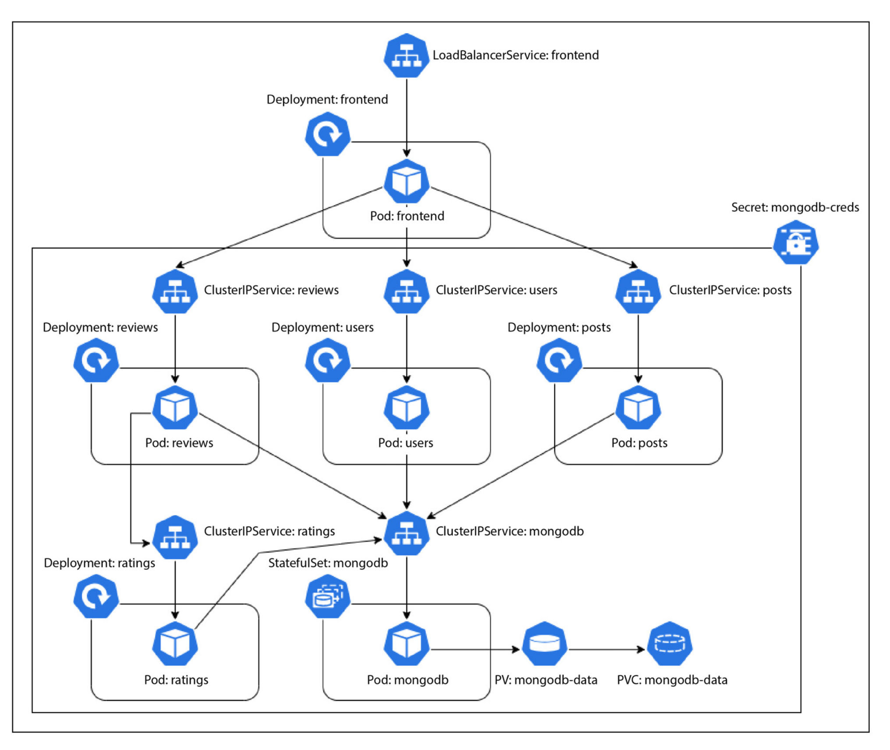

```bash
# creates a kubernetes cluster according to the definitions in yaml file.
kind create cluster --config <kind_config.yaml file> --name <desired_cluster_name>` 
```
---
```bash
# retrieves nodes within kubernetes cluster
kubectl get nodes -o wide
``` 
---
```bash
# Imperatively run a pod within kubernetes cluster
kubectl run <pod_name> --image=<image_name>
```

> **Note**: `kubectl run busybox --image=busybox` will result in CrashLoopBackError, because busybox is not a long running process, that's why it just stops after creation. Instead;
> `kubectl run busybox --image=busybox --command -- /bin/sh -c "sleep 3600"` command should be used to keep busybox running for 1 hour. Then,  it is possible to exec into it using:
> `kubectl exec -it busybox -- /bin/sh`.

---
```bash
 # Deletes the pod in kubernetes cluster.
kubectl delete pod <pod_name>
```
---
```bash 
# Declaratively deploy resources using yaml file to kubernetes cluster.
kubectl apply -f <yaml_file_name>
```
---
```bash
# Imperatively port-forwarding to access the resource that is inside the pod.
kubectl port-forward <pod_name> <host_port>:<pod_port>
``` 
---
```bash
# We can access the logs of a container within a pod using this command
kubectl logs <pod_name> -c <container_name>
``` 
---
```bash
# Get/Go into the pod, pick which container that is aimed to be accessed, and launch a bash session within it. use `exit` to get out from there.
kubectl exec -it <pod_name> -c <container_name> -- /bin/bash
```  

> **Note:** If we modify something in the pod using `exec -it`, it will remain there until pod gets deleted. So, it should only be used for diagnosing stuff, if we want to change something, we should do this change in the application code, or in dockerfile, and then deploy the new image.

```bash
# So useful when a resource within k8s has problems. It is used to troubleshoot issues within the pod, gives events that has happened within the pod.
kubectl describe <pod_name>

#For instance:
kubectl describe externalsecret mongodb-creds -n blog-app
``` 

> **Note:** Kubernetes offers three types of probes, and they are 'startup probe', 'readiness probe', and 'liveness probe'. Once one of these checks fail, the pod will be terminated and restarted.
> 
> 
> 
> `['sh', '-c', 'mkdir -p /usr/share/nginx/html && wget -O /usr/share/nginx/html/index.html http://example.com']` === execute shell within container, and use -c flag to tell the shell to execute the following string. `mkdir -p` makes directories, even if one of the parents do not exist. `wget -O` downloads the URL, and saves it to the directory.

> **Note:** In 'init container', before the main container gets bootstrapped, the init container gets initialized first, and after it does its operations (changing index.html file by using `wget -O`, arranging folder structure using `mkdir -p` etc.) its life-cycle ends, and the main container starts. Its not efficient though, since it delays the start-up time of main container. These configurations should be handled in dockerfile.

```bash
# Expose a pod from a specified port, under the hood it creates clusterIP type of service for exposure
kubectl expose pod <pod_name> --port=<port>
```
---
```bash
# Check the name of the clusters under kind that are running
kind get clusters
```
---
```bash
# Delete a kind cluster
kind delete cluster --name {cluster_name}`
```
---
```bash
# lists all of the contexts in kubeconfig (/home/tuna/.kube/config) file, to see which cluster that we are currently operating on
kubectl config get-contexts
``` 
---
```bash
# switch to different context
kubectl config use-context {CONTEXT_NAME}
``` 
---
```bash
# lists all of the contexts in kubeconfig (/home/tuna/.kube/config) file, to see which cluster that we are currently operating on
kubectl config get-contexts

# delete context in kubeconfig file (/home/tuna/.kube/config)
kubectl config delete-context {context_name}
```
---
```bash
# Check all defined contexts of kubectl.
nvim ~/.kube/config
``` 

```bash
# delete the resources deployed according to the specifications in replicaSet yaml file.
kubectl delete -f <replicaSet_yaml_file_name>`
``` 
---

> **Note:** Kubernetes deployments create replicaSets to manage pods under the hood. For stateful deployments (dbs, caches) use of StatefulSet resource is recommended.
> 
> 

```bash
# Once we have newer container image, (new release), we can imperatively update the image with this command. However, after running this command, the deployment yaml file still remains the same, so imperative approach might not be the best option to update to new release. Plus, you are not keeping track of imperative commands, so always stick with declarative approach.

kubectl set image {deployment_name (deployment/nginx-deployment)} {container_name (nginx>=<new_image (nginx:1.16.1)}
```
---
```bash
# After deploying a new image by modifying its deployment file declaratively, using `kubectl annotate` helps keeping track of deployments.

kubectl annotate deployment <deployment_name (nginx-deployment)> kubernetes.io/change-cause\
="<comment (Updated nginx version to 1.16.1)>" --overwrite=true

```
---
```bash
# To see the history of deployments, aka changes.
kubectl rollout history deployment {deployment_name}
```
---
```bash
# To roll back to the previous version of the deployment, if we find a bug or something in the new release.
kubectl rollout undo <deployment_name (deployment/nginx-deployment>`
``` 

> **Note:** **Recreate** deployment strategy spins down old replicaSet resource and creates a new one. It introduces downtime, so it should not be used in prod environment. The old replicaSet does not get deleted, since we might need to roll-back to previous state.
> 
> 

> **RollingUpdate** deployment strategy initializes new replicaSet, and simultaneously spins down the old replicaSet, while provisioning the new one. It is the default deployment strategy.
> 
> 

> **RampedSlowRollout** strategy uses **maxSurge** and **maxUnavailable** options. **maxSurge** defines maximum number of additional pods we can have at a given time, **maxUnavailable** defines the max number of unavailable pods that we can have at a given time. So if we set **maxSurge** to 1 and **maxUnavailable** to 0, one by one the new replicaset will create new pods and the old replicaSet will delete old pods. It is useful once when we want to be cautious, however it is extremely slow.

> **Note:** **BestEffortControlledRollout** strategy uses **maxSurge** and **maxUnavailable** options, however instead of providing numbers, it provides percentages. so if we set **maxSurge** to 0, and **maxUnavailable** to 25%, total num of pods will be 10 (if we specified 10 replicas), and unavailable pods will be at most 25%.

> **Note:** Services are necessary because exposing a pod on its own is not a good idea. Pods are ephemeral, they are assigned to individual IP addresses that's true but once a pod is gone, its address is also gone.  Service resource provides a static IP address to a group of pods. Beyond that, it also provides load balancing through round-robin method (sequentially each pod serves the request). Service resources also have FQDN (fully qualified domain name), so instead of IP address, we can use fqdn. Kubernetes Service types are LoadBalancer, NodePort, ClusterIP.
> 

> **Note**: ClusterIP type of service exposes pods to the internal world of kubernetes cluster. It is used for resources such as databases, caches which do not need to be exposed to outerworld.

> **Note:** NodePort type of service creates a ClusterIP type of service, and maps its exposed port to one of the ports of all nodes within the cluster. With NodePort service, it is possible to access pods using the IP address of any node, and port number. However, in order to access to those pods, we need to ssh into of the nodes, and then we should do `curl localhost:<assigned_port_number>`. So, still we are not exposed to outer world.

> **Note**: LoadBalancer type of service is used to expose pods to the outer world. Under the hood, it provisions nodePort type of service and then requests cloud provider to spin up a load balancer in front of these nodePorts. However, it is expensive, since it provisions a load balancer from cloud providers.
> 
> 

```bash

# Run a busybox pod in cluster, and after getting out of shell, delete the pod. For debugging, troubleshooting purposes. 
kubectl run busybox-test --rm --restart Never -it --image=yauritux/busybox-curl:latest

# If curl gives name resolution error:
# Get the DNS address with this command (clusterIP)
kubectl get svc kube-dns -n kube-system

# If check fails, check resolv.conf
cat /etc/resolv.conf

# If the nameserver ip addr is not the same as clusterIP addr of kube-dns, update it using:
vi /etc/resolv.conf

# Another image for curl purposes
kubectl run -it --rm --namespace=default --restart Never --image=curlimages/curl curly -- /bin/sh

```
---

> **Note:** FQDN of services follow the template: `<service_name>.<namespace>.svc.<cluster_domain>.local`.
> 

``` bash
# After deploying an nginx ingress, check all the resources that are deployed with it. (Including external load balancer)
watch kubectl get all --namespace ingress-nginx`
```

> **Note**: Ingress resource deploys a loadBalancer type of service, and allows path based routing or host routing. 

```bash
# list ingress resources
kubectl get ingresses
```
---

> Ingresses, services, deployments literally find each other using labels and selectors. Following diagram shows their connections. Deployment configuration create replicaSet that creates 3 pods which have nginx:1.7.9 as their image. In order to expose these pods, service configuration finds these pods using their label. Following diagram has wrong definition of targetPort value (within service manifest file), since nginx container exposes port 80, thus targetPort value should be 80 as well (targetPort is the port that container exposes, and thus pod exposes). Port value is the port that is exposed by service, and that is linked to targetPort. Ingress finds backend service using its name, described in metadata field. (It should be my-service )
> 
> 
> 

```bash
# Load test for 2 minutes, with 100 concurrent users. Useful for hpa testing.
hey -z {load_test_duration_in_seconds 120s} -c {concurrent_user_count 100} {ip_address}
``` 

> **Note:** HorizontalPodAutoscaler resource autoscales pod count depending on cpu usage, memory usage, or external factors such as response time and network latency. For these external factors, usage of Prometheus is a good idea, since it will allow hpa to see these metrics.

> **Note:** StatefulSet resources are similar to deployment resources, however, they also keep track of the state via using volumes mounted on pods.  A volume mounted on one pod can't be used for another pod, and if a pod goes down and gets recreated, the same volume gets mounted on the new one. Plus, pods do not have random hash next to their names, instead, they have numbers in sequence. So, in statefulSet, pods literally have characters, they are treated as men. Headless Service is a clusterIP type of service without an IP address.
> 
> 

> **Note:** Persistent Volumes are resources that deal with storage. It is possible to provision persistent volumes manually or dynamically. Static (Manual provisioning) can be seen in the following diagram.
> 
> 

> **Note**: Dynamic provisioning of volume is much more devops friendly, since it does not include the necessity of provisioning ssd with extra commands within cloud provider. Since we want to be cloud agnostic as much as possible, creating storageClass resource an abstracting the volume creation is much more ideal. The process can be seen in the following diagram. The best part of StorageClass resource is that once a persistentVolumeClaim is deleted, persistentVolume also gets deleted (reclaimPolicy: Delete). However, in manual provisioning has reclaimPolicy: Retain, thus even if we do not use the volume anymore, it stays there. 
> 
> 

> **Note:** DaemonSet resource ensures that a specific pod will be running on each node in the cluster. It is ideal for deploying node-specific services, ideal for log collection and monitoring agents. 

```bash
# List persistentVolumes
kubectl get pv
```
---
``` bash
# List persistentVolumeClaims
kubectl get pvc
```  
---
```bash
# Creates a skeleton yaml file for the deployment, then it is easier to modify the values from there.
kubectl --dry-run=client -o yaml create deployment <deployment_name> --image=<image_name> > <deployment_yaml_file>
``` 

> **Note:** In order to use deployments, services in local kind cluster and access them, we can't use `LoadBalancer` type of service because it is not supported in kind cluster. Instead, we should expose our deployment using `NodePort` type of service, and then naturally kubernetes will map the exposedPort to one of the available ports within 30000-32767 range on nodes, which are docker containers in kind cluster. Then, we can use `kubectl get nodes -o wide` command to get the ip addresses of our nodes to connect to the pods.
> `http://172.18.0.2:31601/` might be a sample IP address of the nodePort type of service.

```bash
# Get the IP address of control plane.
kubectl cluster-info | grep "control plane"
```
---
```yaml
# Create service account to give identity to applications that are running inside of the pods, and give admin privileges to that across the cluster.
apiVersion: v1
kind: ServiceAccount
metadata:
  labels:
    k8s-app: jenkins
  name: jenkins
---
apiVersion: rbac.authorization.k8s.io/v1
kind: ClusterRoleBinding
metadata:
  name: jenkins-crb
  namespace: default
roleRef:
  apiGroup: rbac.authorization.k8s.io
  kind: ClusterRole
  name: cluster-admin
subjects:
  - kind: ServiceAccount
    name: jenkins
    namespace: default

```
---
```yaml
# For more granular access, instead of `ClusterRoleBinding` and `ClusterRole` that gives privileges across whole cluster, we need to define `Role` and `RoleBinding` that is tied to a defined namespace and assign it to the `serviceAccount` that was created within a namespace.
apiVersion: v1
kind: ServiceAccount
metadata:
  labels:
    k8s-app: jenkins
  name: jenkins
  namespace: jenkins
---
apiVersion: rbac.authorization.k8s.io/v1
kind: Role
metadata:
  name: jenkins-admin
  namespace: jenkins
rules:
  - apiGroups: ["*"]
    resources: ["*"]
    verbs: ["*"]
---
apiVersion: rbac.authorization.k8s.io/v1
kind: RoleBinding
metadata:
  name: jenkins-rolebinding
  namespace: jenkins
roleRef:
  apiGroup: rbac.authorization.k8s.io
  kind: Role
  name: jenkins-admin
subjects:
  - kind: ServiceAccount
    name: jenkins
    namespace: jenkins

```
---
```bash
# Create a secret
kubectl create secret docker-registry regcred \
    --docker-username=YOUR_DOCKER_USERNAME \
    --docker-password=YOUR_DOCKER_PASSWORD \
    --docker-email=YOUR_DOCKER_EMAIL \
    --docker-server=YOUR_REGISTRY_SERVER
```

```bash
# Delete everything in a kubernetes cluster within a namespace.
NAMESPACE={default}

# Delete all standard resources
kubectl delete all --all -n $NAMESPACE

# Delete additional resources
kubectl delete pvc --all -n $NAMESPACE
kubectl delete cm --all -n $NAMESPACE
kubectl delete secrets --all -n $NAMESPACE
kubectl delete ingresses --all -n $NAMESPACE
kubectl delete roles --all -n $NAMESPACE
kubectl delete rolebindings --all -n $NAMESPACE
kubectl delete serviceaccounts --all -n $NAMESPACE

# Optionally delete the namespace itself
kubectl delete namespace $NAMESPACE

```
---

> 
> * Kubernetes would reject the deployment, if they are in the same namespace.
> 

> **Note**: The full/whole deployment of simple-blog-app can be seen in the diagram below.
> 
> 

> service discovery -> A Service in one Kubernetes namespace can access a service in another namespace, but you need to use the fully qualified domain name (FQDN) of the service. The FQDN includes the service name, the namespace, and the cluster domain. The format is:
> 
> ```bash
> {service-name}.{namespace}.svc.{cluster-domain}
> ```
> 
> For example, if you have a service named `my-service` in a namespace called `other-namespace`, and your cluster domain is `cluster.local`, you can access it using:
> 
> ```bash
> my-service.other-namespace.svc.cluster.local
> ```
> 
> This way, services can communicate across namespaces within the same cluster.

```bash
# View kubernetes secret resource
# To get the name of the secret
kubectl get secrets -n <namespace blog_app>
# To view the secret manifest
kubectl get secret <secret_name mongodb-creds> -n <namespace blog-app> -o yaml
# To decode it (if it is encoded using base64)
kubectl get secret <secret_name mongodb-creds> -n <namespace blog-app> -o jsonpath="{.data}" | base64 --decode
```
---
```yaml
apiVersion: v1
data:
  # Will be modified with the service account credentials during workflow
  secret-access-credentials: SECRET_ACCESS_CREDS_PH
kind: Secret
metadata:
  name: gcpsm-secret
# An `Opaque` secret is a generic secret type that can store arbitrary key-value pairs. The keys in the `data` field can be any string, and the corresponding values are base64-encoded strings. This type is commonly used when you need to store configuration data, credentials, or other sensitive information that doesn’t fit into the predefined secret types.
type: Opaque

```
---
```bash
# Retrieve all namespaces.
kubectl get namespaces
```
---
```bash
# Retrieve all services across all namespaces which is type of LoadBalancer.
kubectl get services --all-namespaces -o wide | grep LoadBalancer
```
---
```bash
# See which container runtime is running on the node. (containerd or docker)
sudo crictl info | grep "runtimeType"

# If it is docker, then list installed images using:
sudo docker images

# If it is containerd (which is default for k8s), then list installed images using:
sudo crictl images
```

>[!note] How do services communicate with each other in Kubernetes Environment?
>Kubernetes offers built-in service discovery between pods using Kubernetes services and CoreDNS. Consequently, you can direct traffic using the service name from one pod to another.  For example, a service named `frontend` in the `blog-app` namespace would have a DNS name like `frontend.blog-app.svc.cluster.local`.

```bash
# Restart deployments within a defined namespace. It effectively causes Kubernetes to terminate the current pods of deployments and create new ones.

kubectl -n blog-app rollout restart deploy frontend
kubectl -n blog-app rollout restart deploy posts
kubectl -n blog-app rollout restart deploy users
kubectl -n blog-app rollout restart deploy reviews
kubectl -n blog-app rollout restart deploy ratings
kubectl -n blog-app rollout restart statefulset mongodb
```
---
```bash
# View namespace details
kubectl get namespace <namespace-name> -o yaml
```
---
```bash
#List services which have external ip assigned
kubectl get svc --all-namespaces -o jsonpath='{range .items[?(@.status.loadBalancer.ingress)]}{@.metadata.namespace}{"\t"}{@.metadata.name}{"\t"}{@.spec.type}{"\t"}{.status.loadBalancer.ingress[*].ip}{"\n"}{end}' | column -t
```
---
```bash
# Check actual usage of resources, including CPU and memory
kubectl top pods -n blog-app
```
---
```bash
# Exec into a running pod and start a shell session in it
kubectl -n blog-app exec -it $(kubectl get pod -n blog-app | \
grep frontend | awk {'print $1'}) -- /bin/sh
```
---

> In Kubernetes, the `apiVersion` field specifies the API group and version of the resource you are defining. The difference between `api/v1` and `v1` comes down to the specific API group to which each resource belongs:
> 1. **Deployments**:
>     
>     - Defined using `apiVersion: apps/v1`.
>     - The `apps` group is a specific API group introduced to manage resources related to applications, such as `Deployments`, `StatefulSets`, and `DaemonSets`.
>     - The full notation `apps/v1` is used because `Deployments` are not part of the core Kubernetes API (`core/v1`), but rather part of a separate API group (`apps`).
> 2. **Services**:
>     
>     - Defined using `apiVersion: v1`.
>     - Services are part of the core API group (`core/v1`), which is often just referred to as `v1` because it is the default group.
>     - Since the `core` group is the default, `apiVersion: v1` suffices without needing to specify `core`.
> 
> This grouping helps organize and manage Kubernetes resources effectively as the platform evolves, ensuring backward compatibility and clear API boundaries between different resource types.

```bash
# Get Resource Limits, Resource Requests
kubectl get pods -n <namespace blog-app> -o=jsonpath="{range .items[*]}{.metadata.name}{':\n'}{range .spec.containers[*]}{.name}{': Requests CPU='}{.resources.requests.cpu}{', Memory='}{.resources.requests.memory}{', Ephemeral Storage='}{.resources.requests.ephemeral-storage}{'; Limits CPU='}{.resources.limits.cpu}{', Memory='}{.resources.limits.memory}{', Ephemeral Storage='}{.resources.limits.ephemeral-storage}{'\n'}{end}{'\n'}{end}"
```

---
```bash
# Change service type to LoadBalancer
kubectl patch svc my-service -n blog-app -p '{"spec": {"type": "LoadBalancer"}}'

# Change service type to ClusterIP
kubectl patch svc my-service -p -n blog-app '{"spec": {"type": "ClusterIP"}}'
```
---
```bash
# drains the specified node (`$NODE_NAME`) by evicting all running pods, except DaemonSet pods and static pods.
kubectl get nodes 

NODE_NAME=<node_name>

# drains the specified node (`$NODE_NAME`) by evicting all running pods, except DaemonSet pods and static pods; and after draining, the node is set to unschedulable to prevent new pods from being scheduled on it. `uncordon` reverses this, allowing the node to accept new pods.
# Normally, `emptyDir` data is retained, but the flag ensures that these pods are deleted along with their data.
kubectl drain --delete-emptydir-data --ignore-daemonsets $NODE_NAME && kubectl uncordon $NODE_NAME
```

