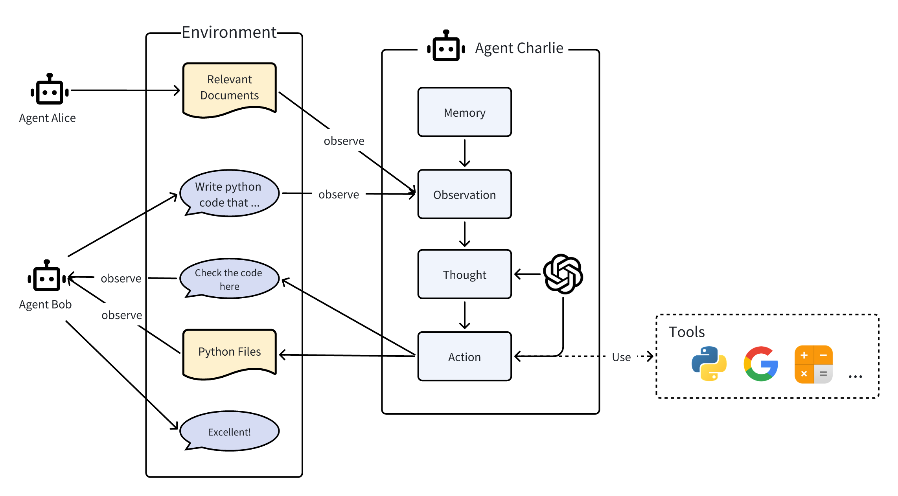

**Q) What are Agents and Multi Agents?**
- Agent = Large Language Model (Brain) + Observation (Sensory Mechanism) + Thought (Internal Decision Making Process) + Action (Responses) + Memory (Store Past Experience)
- Multi-Agent = Agents + Environment (Shared Space) + Standard Operating Procedure (in order execution) + Communication (Exchange of Info) + Economy (System of Value Exchange)

---

