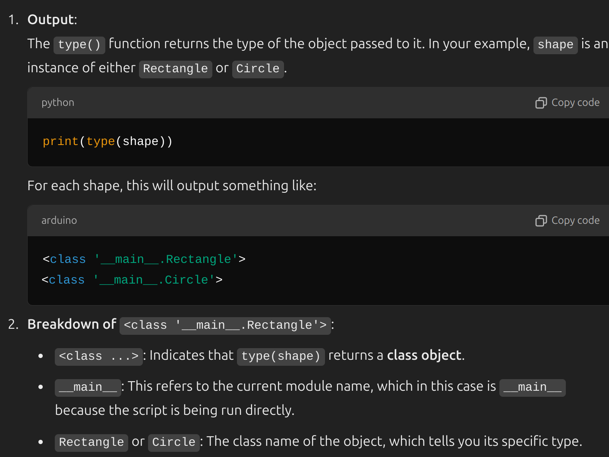

**Note:** In order to run a python application locally, firstly we need to activate venv using `python3 -m venv venv` command. Then, we need activate it using `source venv/bin/activate` command. And then, we can install `pip install -r requirements.txt`, then we can run our app using `python3 app.py` OR `flask run`.  After we are done with our app, we can `deactivate` venv.

---

**Note**: Python is an interpreted language, meaning that it does not need to be compiled into machine code, in order to make it runnable. Also, it reduces the edit-test-debug cycle because there's no compilation step required. However, most Python implementations partially compile scripts, turning the source code into **_byte code_**, which can run on any supported platform. This partial compile is done to improve performance for subsequent runs of the script and happens automatically. You can also generate a "compiled" version of the script and distribute an app without providing the full source code. For instance:
```python
print("Hello, Earth!")
print("Hello, Venus!")
```
Will be executed line by line, and we would get the immediate output. However:
```c
#include <stdio.h>

int main() {
    printf("Hello, World!\n");
    return 0;
}
```
Since C is a compiled language, we firstly need to compile this code machine code using gcc, and execute that output, using the following commands:
```bash
gcc hello.c -o hello
./hello
```

**Note**: Python offers interactive terminal application called REPL (Read-Eval-Print-Loop) to test shorter statements. It can be enabled by running `python3` on terminal. REPL has built-in help function for a specific object that you want to get acquainted, and that is `help([object])`. However, we need to distinguish between callable objects and elements that are part of language's syntax. Callable objects are:
```python
# User defined functions
def my_function():
    print("Hello, World!")
my_function()  # Calling a function

--- 

# Built-in functions
string = "Hello, Earth!"
length_of_string = len(string) # Calling built-in function len()
print(length_of_string)  # Calling built-in function print()  # Output: 13

---

# Functions that belong to objects
class MyClass:
    def my_method(self):
        print("Hello from method!")

obj = MyClass()
obj.my_method()  # Calling a method

---

# Classes
class MyClass:
    pass

obj = MyClass()  # Calling a class to create an instance

---

# Lambda functions
add = lambda x, y: x + y
print(add(2, 3))  # Calling a lambda function


```
And the elements that are part of the syntax are `for`, `while`, `if`, `else`, `elif`, `def`, `class`, `return`, `import`, `pass`, `break`, `continue`, `try`, `except`, `finally`, `with`, `as`, `lambda`, `yield`.

**Note:** Python is a _dynamically typed_ language, meaning the variable type is determined by the data assigned to it.  In the following example, the x and y are integer types; whereas z is float type.  Variable names are case-sensitive and can use any letter, number, and the underscore (`_`) character. However, they can't start with a number.
```python
# Integer
x = 5
print(type(x)) # <class 'int'>

y = 6
print(type(y)) # <class 'int'>

# Float
z = 7.0
print(type(z)) # <class 'float'>

# Boolean
a = True
print(type(a)) # <class 'bool'>

# Case Sensitivity
tunaVar = 4
TunaVar = 6
print(tunaVar) # 4
print(TunaVar) # 6

# Strings
x = 'This is a string'
print(x) # This is a string
print(type(x)) #  <class 'str'>
y = "This is also a string"
```
Integers are a subset of floating point numbers, and Booleans are a subset of integers. Strings can be defined with single quote or double quote. Strings can be concatenated with `+` operator.
```python
x = "Hello " + "World!"
print(x) # outputs: Hello World!
```

**Note:** In order to get user input, python provides built-in function `input()`. The `input` function always returns the typed value as a _string_ (text). This choice makes sense because the user can enter whatever value they like. Even if the input _is_ a valid number, it's still returned as a string type from the `input` function. . To turn the value into a true integer variable, you can use the `int()` function. However, if the provided value is not an integer value, it would result in runtimeError.
```python
name = input('Enter your name:')
print(name)

---

intVal = int(input('Enter your number: '))
print(intVal)

---
numToStr = 6
print("The number is " + str(numToStr))

```
In order to print a number in string concatenation format, it should be formatted into str(). Because strings can only concatenate with strings. Both of these approaches are correct:
```python
first = 5
second = 6
print("The sum is ", first + second) # Notice the comma here

OR

print("The sum is " + str(first+second))
```

To write subsequent lines in REPL, `;\` should be used:
```bash
>>> firstNumber = int(input("FirstNumber: ")) ;\
... secondNumber = int(input("SecondNumber: ")) ;\
... print("The sum is " + str(firstNumber + secondNumber))

```

**Note**: Python has two type of operators, arithmetic and assignment. And some of them can be represented as:
```text
# Arithmetic Operators
1 + 1 # Summation
1 - 1 # Subtraction
1 / 1 # Division
1 * 1 # Multiplication

# Assignment Operators
x = 2
x += 2
x -= 2
x *= 2
x /= 2
```
**Note**: In order to work with the date, we should import date. **`datetime` is a module that contains various classes such as `date`, `time`, `datetime`, `timedelta`. By using this statement, we are only importing the class `date` from module `datetime`**.
```python
from datetime import date

date.today() # datetime.date(2024, 7, 17)

print(date.today()) # 2024-07-17
```
**Note:** In python, `0` and `None` are also accepted as bool type of `False`.
```python
a = 55
b = 44
cond = False
if cond == None:
	print(a) # A is printed

----

a = 55
b = 44
cond = False
if cond == 0:
	print(a) # A is printed
	
```
**Note**: conditional executions are also supported in python:
```python
a = 1
b = 2
c = 3

if a < b:
	if a < c:
	print("a is less than b and c")
	else:
	print("a is less than b but greater than c")
elif a > b:
	print("a is greater than b")
else:
	print("a is equal to b")

# ----

object_size = 10
proximity = 9000

if (object_size > 5) and (proximity < 1000):
	print("Evasive maneuvers required.")
else:
	print("Object poses no threat.")
```
**Note:** In python, strings are immutable, meaning that they can't change. In order to save the updated string, we should store it into another variable.
```python
fact = "The Moon has no atmosphere."
two_facts = fact + "No sound can be heard on the Moon."
print(two_facts)

# ---

a = "This is a string."
a = "this is another string."
print(a) # Prints the latest a
```
**Note**: The usage of quotations may differ, and there are some key things that should be considered. If string contains `""` , then single quotes `''` should be used.  If string contains `''`, then double quotes `""` should be used. If string contains both of them, then triple quotes should be used `"""`.
```python
stringWithDoubleQuote = 'The "near side" is the part of the Moon that faces the Earth.'
stringWithSingleQuote = "We only see about 60% of the Moon's surface."
stringWithBothOfThem = """We only see about 60% of the Moon's surface, this is known as the "near side"."""
```
**Note**: For multi-line strings, `\n` or `"""` should be used.
```python
multiline = "Facts about the Moon:\n There is no atmosphere.\n There is no sound."
print(multiline) 

# OR

multiline = """Facts about the Moon:
 There is no atmosphere. 
 There is no sound."""
print(multiline)
```
**Note**: There are several string methods available in Python.
```python
# Make a string title (make the first letters of each word uppercase)
heading = "temperatures and facts about the moon"
heading_upper = heading.title()
print(heading_upper)

# Split a string according to space character
temperatures = "Daylight: 260 F Nighttime: -280 F"
temperatures_list = temperatures.split(" ")
print(temperatures_list)

# Split a string according to newline character
temperatures = "Daylight: 260F\n Nighttime: -280 F"
temperatures_list = temperatures.split("\n")
print(temperatures_list)

  
# To find if a string is there in another string
temperatures = "Saturn has a daytime temperature of -170 degrees Celsius, while Mars has -28 Celsius."
print(temperatures.find("Moon")) # -1 (it's not there)
print(temperatures.find("has")) # 7 (index of first letter of the string)

# To find if a list contains searched word
true_values = [2,3,4]
if value in true_values:
	return True

# Find the count of a string within a string
temperatures = """Saturn has a daytime temperature of -170 degrees Celsius, while Mars has -28 Celsius."""
print(temperatures.count("Mars")) # 1
print(temperatures.count("Moon")) # 0

# Lowercase letters of a string
print("The Moon And The Earth".lower())

# Uppercase letters of a string
print("The Moon And The Earth".upper())
  
# Check the word is numeric, and starts with or ends with
mars_temperature = (
"The highest temperature on Mars is about 30 C, -6 for testing, 6- for testing"
)
for word in mars_temperature.split():
	if word.isnumeric():
		print(word)
	if word.isdecimal():
		print(word)
	if word.startswith("-"):
		print(word)
	if word.endswith("-"):
		print(word)

# Replace words within a string
mars_temperature = mars_temperature.replace("C", "Celcius")
print(mars_temperature)


# To put strings together
moon_facts = ["The Moon is drifting away from the Earth.", "On average, the Moon is moving about 4cm every year."]
print(' '.join(moon_facts))

# Text formatting
mass_percentage = "1/6"
planet = "Earth"
print(
f"On the Moon, you would weigh about {mass_percentage} of your weight on {planet}."
)

# Round with one decimal point
round = round(100/6, 1)
```
**Note**: In order to search for a string (let's say for "the"), first using `lower()` and then using `count()` would be better, since "The" won't be count if we do not do that.
```python
	text = "The orange is one of the fruits in The market."
	text = text.lower()
	the_count = text.count("the") # 3
```

**Note**: `//` operator does the division and automatically floors the result.
```python
seconds = 1042
minutes = 1042 // 60
print(minutes) # 17
```
**Note**: The precedence of operations are: Parentheses, exponents, multiplication and division, summation and subtraction. `**` is used for exponent.
```python
result = (5 + 4) * 3**2 + 4 - 6
print(result) # 79
```
**Note**: Python supports two main types of numbers: integers (or `int`) and floating point (or `float`). The key difference between the two is the existence of a decimal point; integers are whole numbers, while floats contain a decimal value. Conversion from string to integer and string to float can be seen below. And the absolute value is achieved by `abs()`
```python
demo_int = int('215')
print(demo_int)

demo_float = float('215.3')
print(demo_float)

print(abs(23 - 39)) # 16
```

**Note**: Math library provides more advanced operations and calculations.
```python
from math import ceil, floor

print(ceil(12.4)) # 13
print(floor(12.4)) # 12
```

**Note**: Python has a type for storing a collection of values, and that is called 'list'. It is possible to access individual items in the list with square brackets.
```python
planets = ["Mercury", "Venus", "Earth", "Mars", "Jupiter", "Saturn", "Uranus", "Neptune"]

print("The first planet is", planets[0]) # Mercury
print("The second planet is", planets[1]) # Venus
print("The third planet is", planets[2]) # Earth
```
**Note**: It is possible to modify the elements of the list, and the length of the list can be retrieved by `len()`
```python
planets = ["Mercury", "Venus", "Earth", "Mars", "Jupiter", "Saturn", "Uranus", "Neptune"]
planets[3] = "Red Planet"
print(f"Mars is also known as {planets[3]}")

number_of_planets = len(planets)
print(f"There are {number_of_planets} planets in the solar system.")
```
**Note**: Lists in Python are dynamic: we can add and remove items after they're created using `append()` for addition, and `pop()` for deleting the last element. Negative indexes start from the last element of the list.
```python
planets = ["Mercury", "Venus", "Earth", "Mars", "Jupiter", "Saturn", "Uranus", "Neptune"]
planets.append("Pluto")
planets.pop()
number_of_planets = len(planets)
print(f"There are actually {number_of_planets} planets in the solar system.")
print(planet[-1]) # Neptune

```
**Note**: To find a value in the list, and also find the index of that value, `index()` is being used. If it does not find the value, program gives error, so additional check is necessary.
```python
planets = [
"Mercury",
"Venus",
"Earth",
"Mars",
"Jupiter",
"Saturn",
"Uranus",
"Neptune",
]

for planet in planets:
	if planet == "Ankara":
			ankara_index = planets.index("Ankara")
			print(f"Ankara is the {ankara_index + 1} th planet from the sun")
	if planet == "Jupiter":
			jupiter_index = planets.index("Jupiter") # 4
			print(f"Jupiter is the {jupiter_index + 1}th planet from the sun")

```
**Note**: To find the minimum value within a list, `min(list_name)` can be used. For the maximum value, that becomes `max(list_name)`

**Note**: It is possible to get the subset of list by using slice. Starting index is included, however ending index is not included. If it is not specified, then it gets all elements until the last element (included) of the list. It does not modify the existing list, instead it creates a new one.
```python
planets = ["Mercury", "Venus", "Earth", "Mars", "Jupiter", "Saturn", "Uranus", "Neptune"]
planets_before_earth = planets[0:2]
print(planets_before_earth)

planets_after_earth = planets[3:] 
print(planets_after_earth)

```

**Note**: It is possible to combine/join lists using `+` operator. It does not modify the existing list, it creates a new one by combining them.
```python
amalthea_group = ["Metis", "Adrastea", "Amalthea", "Thebe"]
galilean_moons = ["Io", "Europa", "Ganymede", "Callisto"]

regular_satellite_moons = amalthea_group + galilean_moons
print("The regular satellite moons of Jupiter are", regular_satellite_moons)
```

**Note**: Sorting the list is achieved by `sort()` method. Lists are sorted alphabetically if it is a string typed; numerically from lower to greater values for int or float type. We can also revert the sorting with `sort(reverse=True)`. This method modifies the existing list. `sort()` does not return any value, so it is not possible to assign the sorted list into another variable. It returns `None`.
```python
amalthea_group = ["Metis", "Adrastea", "Amalthea", "Thebe"]
galilean_moons = ["Io", "Europa", "Ganymede", "Callisto"]

regular_satellite_moons = amalthea_group + galilean_moons
regular_satellite_moons.sort()
sorted_list = regular_satellite_moons.sort() # sorted_list is None
regular_satellite_moons.sort(reverse=True)
print("The regular satellite moons of Jupiter are", regular_satellite_moons)
```
**Note**: Python does not have `do-while` loop. Python has many types that can be looped over. These types are known as _iterables_. Python lists are iterable, and they can be used with a `for` loop. You use a `for` loop with iterables where you loop a known number of times, once for each item in the iterable. Most Python code uses four spaces as the unit of whitespace. To save having to press the space bar four times, most editors have a Tab key shortcut that inserts four spaces.

**Note**: Unpacking variables is the process that iterates over the any iterable (list, tuples etc.) and allow us to select those items.
```python
# Example list of lists
turns = [[1, 2], [3, 4], [5, 6]]

# Loop through the list and unpack each inner list
for left, right in turns:
	print(f"Left: {left}, Right: {right}")

# Left: 1, Right: 2
# Left: 3, Right: 4
# Left: 5, Right: 6

```

**Note**: Python dictionaries allow you to work with related sets of data. A _dictionary_ is a collection of key/value pairs. Values can be retrieved by `get()`, and updated by `update()`
```python
planet = {}

planet["name"] = "tuna"

planet["age"] = 99

planet["anotherPlanet"] = {"hero": "tahm", "nation": "mars"}

planet.pop("name")

def print_dictionary(d):

	for key, val in d.items():
	
		if type(val) is dict: # OR type(val).__name__ == "dict":
	
			print()
			
			print(f"Going into dictionary {key}...")
			
			print_dictionary(val)
			
			print("Returned back...")
			
			print()  

		print(f"Key: {key}, and val is: {val}")


print_dictionary(planet)

print(type(planet))

# To retrieve the value of the key which is in nested dictionary
print(f'hey: {planet.get("diameter (km)").get("polar")}')
```
**Note**: `keys()` return list of keys within a dictionary.
```python
rainfall = {"october": 3.5, "november": 4.2, "december": 2.1}

print(rainfall["october"])
print(rainfall.get("october"))
print(rainfall.keys())

# Iterate over each key, and get the value
for key in rainfall.keys():
	print(f"{key}: {rainfall[key]}")

# Another approach to iterate over each key, and get the value
for key in rainfall.keys():
	print(f"{key}: {rainfall.get(key)}")

# keys() returns the list of keys in the dictionary
if "december" in rainfall.keys():
	print("hey")

# values() returns the list of values of keys in the dictionary
if 2.1 in rainfall.values():
	print("tak")
```

**Note**: In simplest form, a function contains code that always returns a value (or values). In some cases, a function also has optional or required inputs. Optional arguments require a default value assigned to them. These named arguments are called **_keyword arguments**_. Keyword argument values must be defined in the functions themselves. When you're calling a function that's defined with keyword arguments, it isn't necessary to use them at all.

```python
from datetime import timedelta, datetime

def arrival_time(destination, hours=51): #hours is keyword argument
    now = datetime.now()
    arrival = now + timedelta(hours=hours)
    return arrival.strftime(f"{destination} Arrival: %A %H:%M")

arrival_time("Earth")
```

**Note**: When we are using **variable arguments**, the function allows any number of arguments (including `0`) to be passed in. The syntax for using variable arguments is prefixing a single asterisk (`*`) before the argument's name.
```python
def sequence_time(*args):
    total_minutes = sum(args)
    if total_minutes < 60:
        return f"Total time to launch is {total_minutes} minutes"
    else:
        return f"Total time to launch is {total_minutes/60} hours"

sequence_time(4,5,1,2)
```

**Note**: For a function to accept any number of keyword arguments, we use `**` syntax. Note that unlike dictionaries, input parameters' keys are not string type, instead, they are arguments, so they do not have quotes.
```python
def crew_members(**kwargs):
	print(f"{len(kwargs.keys())} astronauts assigned for this mission:")

	for key in kwargs.keys():
		print(f"{key}: {kwargs.get(key)}")

crew_members(
captain="Neil Armstrong", pilot="Buzz Aldrin", command_pilot="Michael Collins"
)
```

**Note**: So, we have defined arguments, keyword arguments and variable arguments. We have to pass the arguments if they are defined. we do not need to pass argument if it is keyword or variable arguments. We can combine all of them in single function parameter block if we start with defined arguments firstly.
```python
def sequence_time(name, *args, **kwargs):
	total_minutes = sum(args)
	print(name)
	print(kwargs.get("ahmet")
	if total_minutes < 60:
		return f"Total time to launch is {total_minutes} minutes"
	else:
		return f"Total time to launch is {total_minutes/60} hours"

sequence_time("tuna", ahmet="rustem")
```
**Note**: A _traceback_ is the body of text that can point to the origin (and ending) of an unhandled error. Understanding the components of a traceback will make you more effective when you're fixing errors or debugging a program that's not working well. It is a good practice to catch exceptions for user-friendliness.
```python
try:
	configuration = open("config.txt")
except FileNotFoundError:
	print("Couldn't find the config.txt file!")
except IsADirectoryError:
	print("Found config.txt but it is a directory, couldn't read it")
```

**Note:** In order to run a python application locally, firstly we need to activate venv using `python3 -m venv venv` command. Then, we need activate it using `source venv/bin/activate` command. And then, we can install `pip install -r requirements.txt`, then we can run our app using `python3 app.py` OR `flask run`.  After we are done with our app, we can `deactivate` venv.

---

> 
> Python **lists** and **sets** are both collections but have key differences in their behavior and use cases:
> ### 1. **Duplicates**
> 
> - **List**: Allows duplicates. Example: `[1, 2, 2, 3]`
> - **Set**: Does not allow duplicates. Example: `{1, 2, 3}` (any duplicates are automatically removed).
> 
> ### 2. **Order**
> 
> - **List**: Maintains the order of elements. Example: `[1, 3, 2]` stays in that order.
> - **Set**: Does not guarantee order. Example: `{1, 3, 2}` might appear as `{1, 2, 3}` or in another internal order.
> 
> ### 3. **Mutability**
> 
> - **List**: Mutable; supports indexing, slicing, and direct element updates.
> - **Set**: Mutable; but does not support indexing or slicing (because of unordered nature).
> 
> ### 4. **Performance**
> 
> - **List**: Searching for an element is slower (`O(n)` complexity).
> - **Set**: Searching for an element is faster (`O(1)` complexity on average) due to its hash-based implementation.
> 
> ### 5. **Use Cases**
> 
> - **List**: Use when you need ordered data, duplicates, or sequence-based operations.
> - **Set**: Use when uniqueness and fast membership tests are important.
> ```python
> # List example 
> my_list = [1, 2, 2, 3] 
> print(my_list) # Output: [1, 2, 2, 3] 
> # Set example 
> my_set = {1, 2, 2, 3} 
> print(my_set) # Output: {1, 2, 3} (duplicates removed)
> ```

> ### **Tuple**
> 
> - **Ordered**: The elements in a tuple maintain their sequence.
> - **Immutable**: Once created, you cannot modify, add, or remove elements.
> - **Allows Duplicates**: Can contain duplicate values.
> - **Access by Index**: You can access elements using an index (`my_tuple[0]`).
> 
> **Use Case**:
> 
> - When you need a fixed collection of items that should not change, like coordinates (`(x, y)`) or database rows.
> - When the order of elements matters.
> - For lightweight structures to return multiple values from a function.
> ---
> 
> ### **Set**
> 
> - **Unordered**: No guaranteed order of elements.
> - **Mutable**: You can add or remove elements, but the elements themselves must be immutable.
> - **No Duplicates**: Automatically eliminates duplicate values.
> - **Membership Testing**: Fast lookup for checking if an element exists (`x in my_set`).
> 
> **Use Case**:
> 
> - When you need a collection of unique elements, like a set of tags or unique IDs.
> - For efficient membership checks or mathematical set operations (union, intersection).

---

> 
> The difference between **classes** and **modules** in Python lies in their purpose and scope:
> ###### **1. Modules**
> 
> - **Definition:** A **module** is a file containing Python code (e.g., `car.py`). It can include definitions of functions, variables, and classes (a module can contain multiple classes).
> - **Purpose:** Organizes and groups related code into a file that can be imported and reused in other parts of your program.
> - **Scope:** Global. Anything in the module (classes, functions, variables) is accessible once the module is imported.
> ###### **2. Classes**
> 
> - **Definition:** A **class** is a blueprint for creating objects. It defines how the objects behave (methods) and what data they hold (attributes).
> - **Purpose:** Encapsulates related data and behavior into reusable, logical units (objects).
> - **Scope:** Local to the module or program. You need to instantiate a class to use its behavior.
> 

> For encapsulation purposes, Python follows the principle of **consenting adults**, meaning it trusts developers to respect conventions like:
> - `_balance`: Protected, meant for internal use, but still accessible.
> - `__balance`: Private, harder to access without intentional effort.

---
Understanding `type(shape)` output


---
Class Objects vs. Instance Objects
```python

from abc import ABC, abstractmethod
class Shape(ABC):
	def __init__(self, name:str):
		self.name = name

print(type(Shape)) #< class '__main__.Shape'

shape1 = Shape("circle")
print(type(shape1)) #< class '__main__.Shape'
```
---
**Q) How does Python enables encapsulation for private fields?**
In Python, name mangling is a technique used to make private attributes more secure. When you define an attribute with a double underscore prefix. Python internally changes the name of the attribute to include the class name. This makes it harder to accidentally access or modify private attributes from outside the class.
```python
class BankAccount:
	def __init__(self, account_number: str):
		# Private field
		self.__account_number = account_number

	def get_account_number(self) -> str:
		return self.__account_number

bank1 = BankAccount("1235")
print(bank1_BankAccount__account_number) # would print 1235
print(bank1.__account_number) # would throw an error attributeNotFound
```
---
Q) **Public vs Protected vs Private**
* **Private field**: neither can be accessed from subclasses, nor outside
* **Protected Field**: can be accessed from subclasses, but cannot from outside (however, it is possible to access a protected field in python from outside. It is not strict.)
* **Public Field:** can be accessed from subclasses and outside

---
Q) **`nonlocal` vs `global`**
```python

x = 5  # Global variable

def outer():
    y = 10  # Enclosing variable

    def inner():
        global x  # Refers to the global `x`
        x = 15

        nonlocal y  # Refers to `y` in `outer`
        y = 20

    inner()
    print("y in outer:", y)  # Output: y in outer: 20

outer()
print("x in global:", x)  # Output: x in global: 15

```

---
**Q) Functions vs methods?**
Functions can exist anywhere in the code block, however we say method to functions that reside in a Class instance, in other words, **functions that belong to a particular object are called as methods.**

---
**Q) Why do we have underscores before and after of some methods?**
These methods are called as **magic** **methods**, and each of them provides different functionality. For instance, __init__ function is called every time an object is instantiated. __call__ function makes a class as a callable function, and an example would be:
```python
class Example:
    def __init__(self, value):
        self.value = value

    def __call__(self):
        print(f"Called with value: {self.value}")

example = Example(42)
example()  # This will print: Called with value: 42
# Similar to -> example.__call__()
```

---
Q) What is `yield`?
yield statement temporarily suspends the execution of the function/method and passes the control back to context manager. 
Reference: https://github.com/tunacinsoy/mastering-python-software-development/blob/main/ch01-intro/11-contextManagers.py
```python
from contextlib import contextmanager
import time

@contextmanager
def timer():
    start = time.time()  # Setup: start the timer
    yield  # Yield control to the block inside the with statement
    end = time.time()  # Teardown: end the timer
    print(f"Elapsed time is: {end - start}")

# Using the context manager
with timer():
    time.sleep(2)  # Block of code where the context is active
```
---
Q) What are the types of testing in Python?

1. **Unit Testing:** Focuses on testing individual components or functions
in isolation.
2. **Integration Testing**: Verifies that different components work together
correctly.
3. **Functional Testing**: Ensures that the software meets the specified
functional requirements.
4. **Acceptance Testing:** Determines if the software meets the end-user's
expectations and requirements.
5. **Performance Testing:** Evaluates the system's performance under
various conditions.
6. **Security Testing:** Identifies vulnerabilities and ensures the system is
secure against potential threats.

---
```bash

# Create requirements.txt file and put dependencies in there
pip freeze > requirements.txt

# Create venv
python -m venv <venv_name>

# Activate venv
source metagpt_env/bin/activate

# Install the dependencies that is listed in requirements file
pip install -r requirements.txt
```