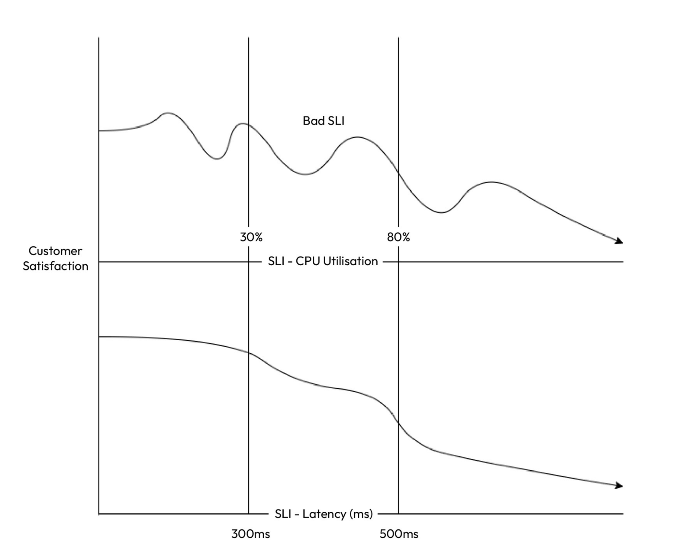
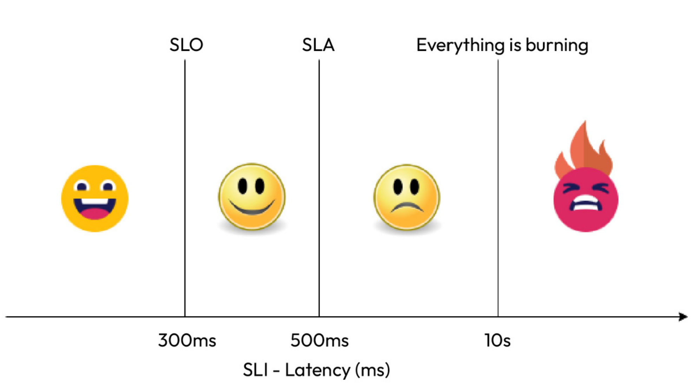
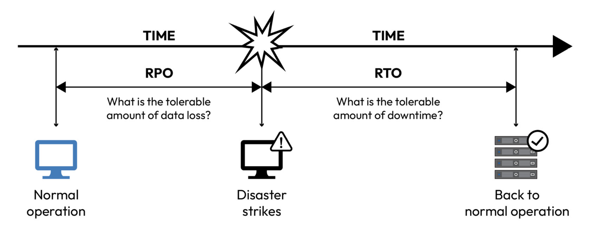

**Note**: For google, site reliability engineers should seek opportunities to automate manual tasks (toils), and they possess the requisite skills to develop software solutions, even when faced with complex challenges. So, SREs are software engineer that does the ops part.

**Note**:"95th percentile of response time has exceeded the service-level objective (SLO) by %10" means that 5 percent of response times took more than 110 * SLO / 100 seconds. So if SLO is 1 second, 5 percent of response times took more than 1.1 seconds.

#### SLI (Actual)
**Note**: Service Level Indicators serve as quantifiable reliability metrics. Google defines them as “carefully defined quantitative measures of some aspect of the level of service provided.”
Common examples are request latency, failure rate, data throughput. There are 4 golden signals that can be named as SLI:
* **Latency**: The time that it takes for any service to respond to user requests.
* **Errors**: Percentage of failed requests, highlights issues in service reliability.
* **Traffic**: Represents the demand towards any service, reflecting its usage.
* **Saturation**: How fully the infrastructure components are utilized.

**Note**: SLIs can be calculated as: (Good Events * 100) / (Valid Events). So for instance, we can calculate good events as latency metrics that are below of certain threshold, and all latency metrics that were calculated as valid events.

**Note**: A valuable SLI should align closely with the user experience. For example, a lower SLI value should correspond to decreased customer satisfaction. If this alignment is absent, the SLI may not provide meaningful insights or be worth measuring. In the following graph, cpu utilization does not directly affect customer satisfaction, it only does it after 80%. However, latency is directly related with customer satisfaction. So latency would be a better sli to select.

**Note**: Too many SLIs can lead to team confusion and trigger numerous false alarms. It’s best to focus on four or five metrics directly linked to customer satisfaction. For instance, instead of monitoring CPU and memory usage, prioritize metrics such as request latency and error rate.

#### SLO (Target)
**Note:** Google’s definition of SLOs states that they “establish a target level for the reliability of your service.” They specify the percentage of compliance with SLIs required to consider your site reliable. SLOs are formulated by combining one or more SLIs. Common SLOs are:
* Latency
* Error Rates
* Availability

**Note**: Since internet comprises a lot of components, aiming to achieve 100% SLO2 is not feasible. Moreover, a completely reliable application leaves no room for the introduction of new features, as any new addition has the potential to disrupt the existing service. Therefore, some margin for error must be built into your SLO.
 

#### SLA (Agreed Upon)

**Note**: According to Google, SLAs are “formal or implicit agreements with your users that outline the repercussions of meeting (or failing to meet) the contained SLOs.”

**Note**: For instance, when considering the request latency SLI, the SLO might be defined at a 300ms SLI value, while the SLA could be set at a 500ms SLI value. This distinction arises from the fact that SLOs are internal targets related to reliability, whereas SLAs are external commitments. Following graph shows the relation between them.

#### Error Budgets (Allowance)

**Note**: As defined by Liz Fong-Jones and Seth Vargo, error budgets represent “a quantitative measure shared between product and SRE teams to balance innovation and stability.” They represent the permissible amount of downtime or errors that can occur before the SLOs are violated.

**Note**: New features, new functionalities inherently come with possibility of failures, and thus, that's why we are not setting 100% SLO. Because error budgets are calculated as:
```
Error Budget = 100% - SLO

If SLO is 90% for availability, then Error Budget becomes 10%, and it introduces 36.5 days of downtime in a year.

365 days/year x Error Budget = Downtime in Days

Downtime Days x 24 hrs/day = Total Downtime in Hours

Downtime Hours x 60 minutes/hour = Total Downtime in Minutes

Downtime Minutes x 60 secs/minutes = Total Downtime in Seconds
```

**Note**: With an SLO of 99%, the error budget allows for 1% of requests to exceed 300 milliseconds. For 1,000,000 requests, this means 10,000 requests can be slower without breaching the SLO. This month, 30,000 requests exceeded the threshold, using up the error budget and exceeding it by 20,000 requests. By this, we are actually creating a buffer zone for new products, updates and features.

To sum up:
- **SLO (Service Level Objective):** Sets the performance goal (e.g., 99% of API requests under 300 milliseconds).
- **SLI (Service Level Indicator):** Measures current performance (e.g., 97% of API requests under 300 milliseconds).
- **SLA (Service Level Agreement):** Formal agreement with consequences for not meeting performance goals (e.g., 99% response time guarantee with a 5% service credit for non-compliance).
- **Error Budget:** The allowable amount of errors or failures (e.g., 1% of API requests can exceed 300 milliseconds out of 1,000,000 total requests).

#### Disaster Recovery (DR) (Restore)
**Note**: Disaster recovery is a comprehensive strategy that’s designed to ensure an organization’s resilience in the face of unexpected, disruptive events, such as natural disasters, cyber attacks, or system failures.

**Note**: Every organization incorporates disaster recovery to varying degrees. Some opt for periodic backups or snapshots, while others invest in creating failover replicas of their production environment. Although failover replicas offer increased resilience, they come at the expense of doubling infrastructure costs.

**Note**: Recovery Time Objective (RTO) represents the maximum acceptable downtime for a system or application, specifying the time within which it should be restored after a disruption. It quantifies the acceptable duration of service unavailability and drives the urgency of recovery efforts.

**Note**: RPO defines the maximum tolerable data loss in the event of a disaster. It signifies
the point in time to which data must be recovered to ensure business continuity. Achieving a low RPO means that data loss is minimized, often by frequent data backups and replication. The following figure explains RTO and RPO:

#### SRE Responsibilities

* **SLOs**: SREs begin by defining clear SLOs that outline the desired level of reliability for the distributed application. SLOs specify the acceptable levels of latency, error rates, and availability. These SLOs are crucial in guiding the team’s efforts and in determining whether the system is meeting its reliability goals.
* **SLIs:** SREs establish SLIs, which are quantifiable metrics that are used to measure the reliability of the application. These metrics could include response times, error rates, and other performance indicators. SLIs provide a concrete way to assess whether the application meets its SLOs.
* **Error budgets:** Error budgets are a key concept in SRE. T hey represent the permissible amount of downtime or errors that can occur before the SLOs are violated. SREs use error budgets to strike a balance between reliability and innovation. If the error budget is exhausted, it may necessitate a focus on stability and reliability over introducing new features.
* **Monitoring and alerting**: SREs implement robust monitoring and alerting systems to continuously track the application’s performance and health. They set up alerts based on SLIs and SLOs, enabling them to respond proactively to incidents or deviations from desired performance levels. In the realm of distributed applications, using a service mesh such as Istio or Linkerd can help. They help you visualize parts of your application through a single pane of glass and allow you to monitor your application and alert on it with ease.
* **Capacity planning:** SREs ensure that the infrastructure supporting the distributed application can handle the expected load and traffic. They perform capacity planning exercises to scale resources as needed, preventing performance bottlenecks during traffic spikes. With modern public cloud platforms, automating scalability with traffic is all the more easy to implement, especially with distributed applications.
* **Automated remediation:** Automation is a cornerstone of SRE practices. SREs develop automated systems for incident response and remediation. This includes auto-scaling, self-healing mechanisms, and automated rollback procedures to minimize downtime.
* **Chaos engineering:** SREs often employ chaos engineering practices to introduce controlled failures into the system deliberately. This helps identify weaknesses and vulnerabilities in the distributed application, allowing for proactive mitigation of potential issues. Some of the most popular chaos engineering tools are Chaos Monkey, Gremlin, Chaos Toolkit, Chaos Blade, Pumba, ToxiProxy, and Chaos Mesh.
* **On-call and incident management:** SREs maintain on-call rotations to ensure 24/7 coverage. They follow well-defined incident management processes to resolve issues quickly and learn from incidents to prevent recurrence. Most SRE development backlogs come from this process as they learn from failures and, therefore, automate repeatable tasks.
* **Continuous Improvement:** SRE is a culture of continuous improvement. SRE teams regularly conduct post-incident reviews (PIRs) and root cause analyses (RCAs) to identify areas for enhancement. Lessons learned from incidents are used to refine SLOs and improve the overall reliability of the application.
* **Documentation and knowledge sharing:** SREs document best practices, runbooks, and operational procedures. They emphasize knowledge sharing across teams to ensure that expertise is not siloed and that all team members can effectively manage and troubleshoot the distributed application. They also aim to automate the runbooks to ensure that manual processes are kept at a minimum.