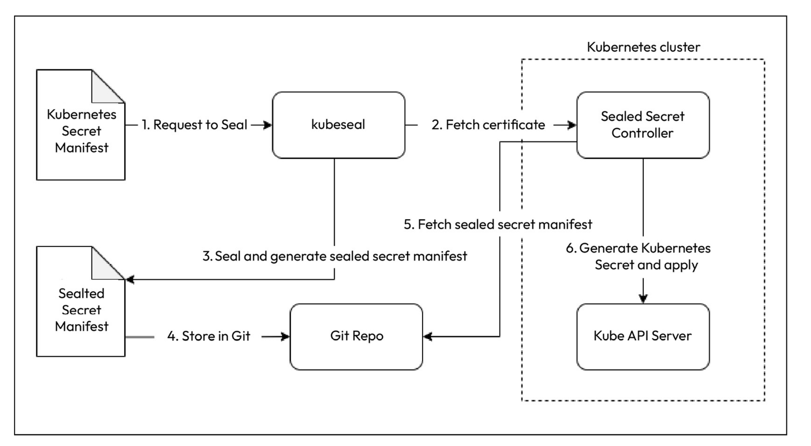

Sealed Secrets solves the problem of I can manage all my Kubernetes config in Git, except
Secrets. Sealed Secrets function as secure containers for your sensitive information. When you require a storage solution for secrets, such as passwords or keys, you place them in these specialized packages.

Only the Sealed Secrets controller within Kubernetes can unlock and access the contents. This ensures the utmost security and protection for your valuable secrets. Created by Bitnami Labs and open sourced, they help you encrypt your Kubernetes Secrets into Sealed Secrets using asymmetric cryptography that only the Sealed Secrets controller running on the cluster can decrypt. This means you can store the Sealed Secrets in Git and use GitOps to set up everything, including Secrets.

Sealed Secrets comprises two components:
* A client-side utility called kubeseal helps us generate Sealed Secrets from standard Kubernetes Secret YAML
* A cluster-side Kubernetes controller/operator unseals your secrets and provides the key certificate to the client-side utility

```bash
wget https://github.com/bitnami-labs/sealed-secrets\
/releases/download/v0.27.1/controller.yaml
```
Download the sealedsecret controller installation manifest file.

After we deploy the sealed-secrets-controller to the k8s environment, we can check the resource using:
```bash
kubectl get deployment -n kube-system sealed-secrets-controller
```

```bash
# In order to seal a secret using sealedSecrets, following cmd sequence should be used
kubectl create secret generic mongodb-creds \
--dry-run=client -o yaml --namespace=blog-app \
--from-literal=MONGO_INITDB_ROOT_USERNAME=rootAdmin \
--from-literal=MONGO_INITDB_ROOT_PASSWORD=P433sw0rd123! \
| kubeseal -o yaml > mongodb-creds-sealed.yaml

# After the deployment, we might need to scale down statefulsets and deployments using following command:
kubectl scale statefulset -n blog-app mongodb --replicas 0
kubectl scale statefulset -n blog-app mongodb --replicas 1

```
And once we deploy this manifest file, it will deploy the secret named `mongodb-creds`, which is only can be decrypted by sealed-secrets controller. 

**Note**: Once we retrieve the secret values, we use `mongodb-creds`, not `mongodb-creds-sealed`. 
```
envFrom:
	- secretRef:
		name: mongodb-creds
```