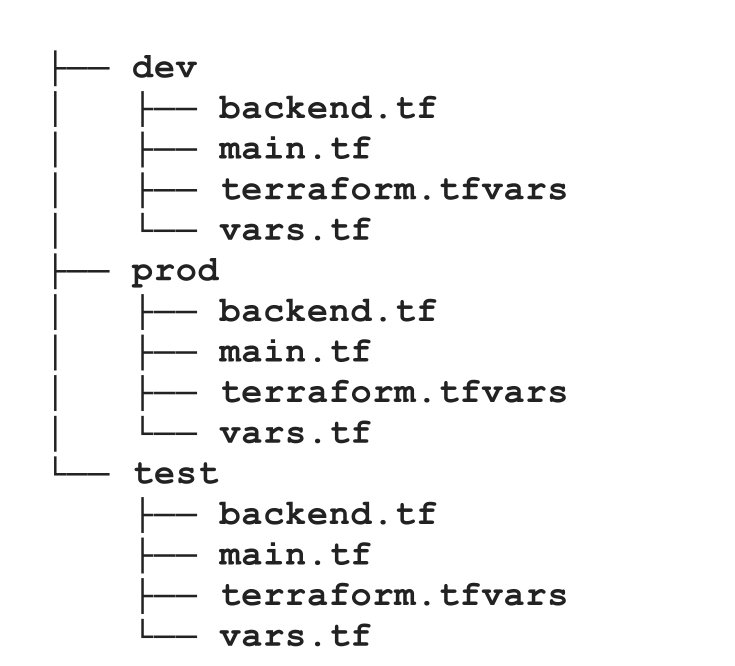
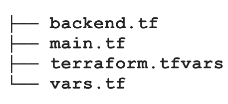
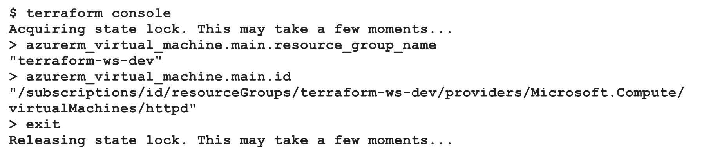
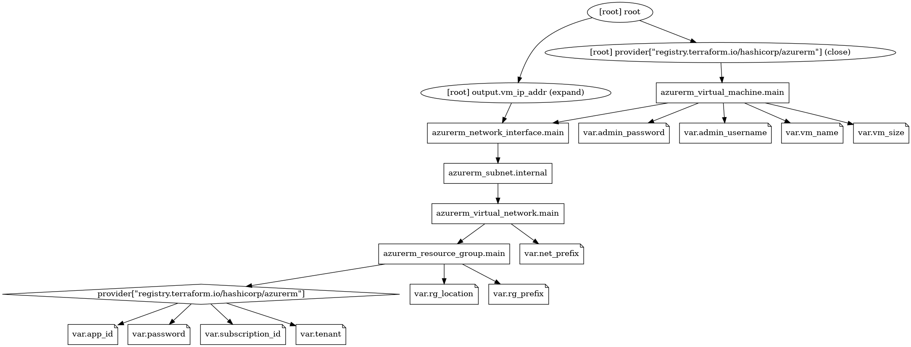

****

**Note:** Terraform has 2 main components. **Terraform Core** is the CLI tool that we use to interact with Terraform. It takes two main inputs, and they are the existing state and the configuration (modules, main.tf, vars.tf and .tfvars files) that we want to make. It applies the difference between these two inputs. **Terraform Providers** are the plugins that Terraform use in order to provision resources. Providers translate the desired configuration into the respective cloud's REST APIs. For instance, if we want to create some resource on cloud using hcl, terraform basically converts the specifications into PUT request with defined parameters.

```bash
wget -O- https://apt.releases.hashicorp.com/gpg | sudo gpg --dearmor -o /usr/share/keyrings/hashicorp-archive-keyring.gpg
echo "deb [signed-by=/usr/share/keyrings/hashicorp-archive-keyring.gpg] https://apt.releases.hashicorp.com $(lsb_release -cs) main" | sudo tee /etc/apt/sources.list.d/hashicorp.list
sudo apt update && sudo apt install terraform
```
Download Terraform. This command sequence adds the repository of hashicorp into the apt sources list.

```bash
# Terraform variable values and provider binary downloaded after 'terraform init'
*.tfvars
.terraform*

# Terraform detailed execution plan binary after running 'terraform plan'
*.tfplan

# Terraform tfstate files (if local backend is used)
*.tfstate
*.tfstate.backup
```
Add all .tfvars files that are inside of current directory into .gitignore. After we run `terraform init`, terraform also creates new folder named `.terraform` and executable binaries for provider, so we should also add them into .gitignore. `.tfplan`, `.tfstate`, `.tfstate.backup` files should also be stated in .gitignore.

```bash
terraform init
```
Initializes the Terraform workspace and backend and downloads all required providers that are stated in main.tf in root directory (let's begin command). It does not change the workspace or backend, so it can be run multiple times during build (I am done with the declarative files, let's roll) process.

```bash
terraform fmt
```
Formats the files syntactically into canonical standard.

```bash
terraform validate
```
Validates all of the configurations and checks if there is anything wrong.

```bash
terraform plan -out <file_name rg_terraform_first.tfplan>
```
This command runs a speculative plan on requested resources. It connects to cloud API to check the requested objects exist. It then shows the delta in the plan output that an admin can review and change the configuration if unsatisfied. Finally, it outputs the detailed execution plan into a file. It does not make any change in current infrastructure. It's a good practice to output the plan, since we know what will be applied when we run `apply` command.

```bash
terraform apply "file_name rg_terraform_first.tfplan"
```
Apply (literally do the operations which are defined in .tfplan file) to our infrastructure.

```bash
terraform taint <resource_name azurerm_resource_group.rg>
```
When we use `terraform apply`, sometimes some of the resources are not getting created successfully, and terraform automatically taints them to recreate them in the next run. We can also manually taint resources to make them recreated again.

```bash
terraform plan -destroy -out <file_name rg_terraform_first_destroy.tfplan>
```
In order to destroy the resources that we have deployed (they are stated in .tfstate file), we can run a speculative command to see which resources will be effected. Then, we are outputting the detailed execution plan, so that we have tangible file that expresses what will be done.

**Note**: Terraform modules enable reusable, modular templates. For instance, if we define a module `resource_group`, this module will also have its own `main.tf` and `vars.tf` files. However, the exact values of these variables will be passed from `vars.tf` file during the initialization of this module in `main.tf` file in root directory. This part can be seen down below. It's a good practice to modularize the hcl files as much as possible. 
```hcl
module "rg" {
source = "./modules/resource_group"
name = var.rg_name
location = var.rg_location
}
```

**Note:** Terraform uses .tfstate files in order to detect the current state of the infrastructure. Keeping them locally is not a good idea, since multiple people might want to configure existing infrastructure, and using git is not the best option. Because if we stage it to git repository, then it might be modified mistakenly, and thus that's not the case we want to see. It should stay in where it will be protected, thus, we can use Azure Storage for this purpose.

**Note**: Since we need multiple environments such dev, test, and prod in software development, we also need to separately create these environments, and they have to be identical. If we want do to something like this, the structure would become like:

However, the duplication is there, and only change happens in terraform.tfvars files. That's why we have workspaces in terraform. Terraform workspaces are nothing but independent state files. So we will have only one set of configuration files, and multiple state files. Thus, the final directory content becomes:

```bash
terraform init
terraform workspace new <workspace_name>
```
Create new workspace.

```bash
terraform workspace select <workspace_name>
```
Switch to an existing workspace.

**Note:** While we are defining resources, we can use the name of current workspace as follows:
```
resource "azurerm_resource_group" "main" {
name = "${var.rg_prefix}-${terraform.workspace}"
location = var.rg_location
}
```

**Note**: If we are using local backend for .tfstate files, we would see the following structure of .tfstate files. However, in remote repositories, each .tfstate file is suffixed with `env:<env_name>`. So for instance, an example would be `terraform-remote-backend.tfstateenv:dev`


**Note**: Terraform output files output specific values after the creation of the module or resource. For instance, we can output the name of a resource group to be able to specify which resource group the storage account or virtual network will be in. Following `output.tf` file exports name and the location of the resource group.

```
output "resource_group_name" {
value = azurerm_resource_group.rg.name
}

output "resource_group_location" {
value = azurerm_resource_group.rg.location
}
```

```
terraform show
```
To see all resources that terraform has created and manages.

```
terraform state list
```
To see the list of resources in .tfstate file.

```
terraform state rm <resource_name azurerm_virtual_machine.main> 
```
Remove a resource from the management of terraform. It does not remove the existing resource, terraform just stops managing it. Might be useful when someone manually deletes it from azure, and that is no longer needed.

```
az resource show --resource-group MyResourceGroup --name MyVM --resource-type \
Microsoft.Compute/virtualMachines --query id --output tsv

terraform import <resource azurerm_virtual_machine.main> <resource_id>
```
To import a resource that is created manually into terraform management, we can use `import` command.

**Note**: Terraform also provides a `console` to manage, investigate resources.


**Note:** Terraform uses a dependency model to manage in what order resources are created and destroyed. There are two kinds of dependencies – implicit and explicit. We’ve been using implicit dependencies until now, where the VM depended upon the network interface, and the network interface depended upon the subnet. The subnet depended upon the virtual network, and all of these resources depended on the resource group. These dependencies naturally occur when we use one resource’s output as another’s input. It is possible to use `depends_on` attribute if we want to explicitly state dependencies. However, Terraform uses parallelism, that's why using `depends_on` attribute might slow down the `apply` process.

**Note**: 
```
terraform graph > graph.dot
sudo apt install graphviz -y
cat graph.dot | dot -T png -o graph.png
```
To visualize the terraform configurations in hierarchical order. Example diagram can be seen below.


```
terraform {
	backend "gcs" {
		#bucket = "tf-state-mdo-terraform-${var.project_id}"
		prefix = "sba-terraform"
		#prefix = var.prefix is not allowed
	}
}
```
For backend config, using variables from `vars` file is not allowed. It needs to be explicitly stated.

**Q**: When to use `locals` or `outputs`?
- **Use Locals for Readability**: If an attribute is used multiple times or if naming it can make the code clearer, consider using a `local` variable. This keeps your code clean while improving readability.
- **Use Outputs in Modules**: If you are writing modules, always expose important attributes through `output` blocks so they can be easily consumed by other modules or configurations.